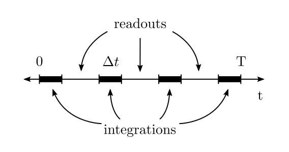
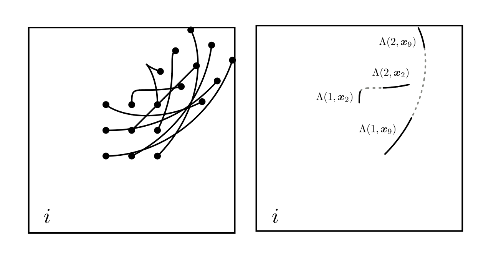

[TOC]

### Time Budget Model

I've worked out a model in an attempt to illustrate the tradeoff between noise reduction and image blurring when deciding on integration time.

I assume the scene $i$ is rotating at a rate of $\theta$ radians per second and translating $\bm{c}$ pixels per second relative to the CCD.  The problem is to choose an integration time $\Delta t$ which gives the best estimate for $\theta$ and $\bm{c}$.

{: style="width:25em" }

The total number of measurements $M$ is constrained by $\Delta t$, the total time budget $T$, and the CCD readout time.  The readout time is the amount of time it takes to read and clear the charge collected on the CCD's potential wells.

$$
M \Delta t + (M - 1) \text{(readout time)} < T
$$

I define $\widetilde{i}_k$ to be the measurement made during the $k$th integration.  Assuming additive Gaussian noise, these measurements have the following form:

$$
\widetilde{i}_1(\bm{x}) = \int_0^{\Delta t} i(R_{\theta t} \bm{x} - \bm{c} t) dt + \mathcal{N}(0, \sim 1 / \Delta t) \\
\vdots \\
\widetilde{i}_k(\bm{x}) = \int_{\frac{T + \Delta t}{M}(k - 1)}^{\frac{T + \Delta t}{M}(k - 1) + \Delta t} i(R_{\theta t} \bm{x} - \bm{c} t) dt + \mathcal{N}(0, \sim 1 / \Delta t) \\
\vdots \\
\widetilde{i}_M(\bm{x}) = \int_{\frac{T + \Delta t}{M}(M - 1)}^{T} i(R_{\theta t} \bm{x} - \bm{c} t) dt + \mathcal{N}(0, \sim 1 / \Delta t) \\
$$

The Gaussian noise variance is inversely proportional to integration time and is dependent on CCD characteristics.  A larger $\Delta t$ will result in decreased noise.

For convenience, let

$$
\Lambda(k, \bm{x}) = \int_{\frac{T + \Delta t}{M}(k - 1)}^{\frac{T + \Delta t}{M}(k - 1) + \Delta t} i(R_{\theta t} \bm{x} - \bm{c} t) dt
$$

This represents the energy collected by the CCD in pixel $\bm{x}$ during the $k$th time integration.  We can visualize each $\Lambda(k, \bm{x})$ as a line integral over $i$ parameterized by $t$.

It's clear from the above diagram that a larger $\Delta t$ will increase blurring in $\widetilde{i}_k$ from the relative motion of the CCD and scene.

##### Poisson Formulation

I also wrote the same model using Poisson noise instead of additive Gaussian noise, but it is rather more complicated and requires the [inhomogeneous Poisson process](https://en.wikipedia.org/wiki/Poisson_point_process#Inhomogeneous_Poisson_point_process).

$$
\widetilde{i}_k(\bm{x}) = N(k, \bm{x})
$$

where $N$ is an inhomogeneous Poisson point process over some region in $i$ defined by $k$ and $\bm{x}$.  The pmf of $N$ is given by 

$$
P(N(k, \bm{x}) = n) = \frac{\Lambda(k, \bm{x})^n}{n!} e^{-\Lambda(k, \bm{x})} \\
$$

##### Assumptions and Possible Model Deficiencies

- **noise** - additive Gaussian and has decreasing variance with integration time.  This is not necessarily true in reality.  For example, readout noise is neither Gaussian nor does it decrease with increasing integration time.
- **time budget** - There is only a fixed, pretermined block of $T$ seconds to make a motion estimate.  This may an oversimplified assumption for a real mission with complex constraints.
- **motion constraints** - Rotation and translation are the only motions present and have constant rate.  In real systems, more complex motion is possible which includes skew/shear and jitter.
- **image support** - Images have finite support and are fully visible in the captured region.  Real registration images have pixel regions which are not common to both images, which adds error to the registration estimate that is difficult to model.
<!-- - **no CCD readout/clearing time** - Capture of $\widetilde{i}_{k+1}$ begins immediately after $\widetilde{i}_k$.  In reality, CCDs take a nonzero amount of time to readout and clear well charges.  I've read this can be over 0.5s for a 2k by 2k array. -->
