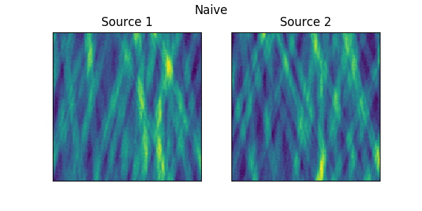
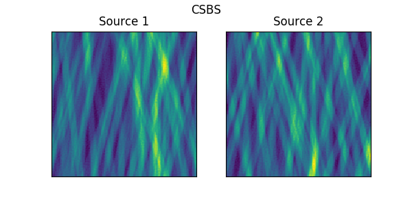
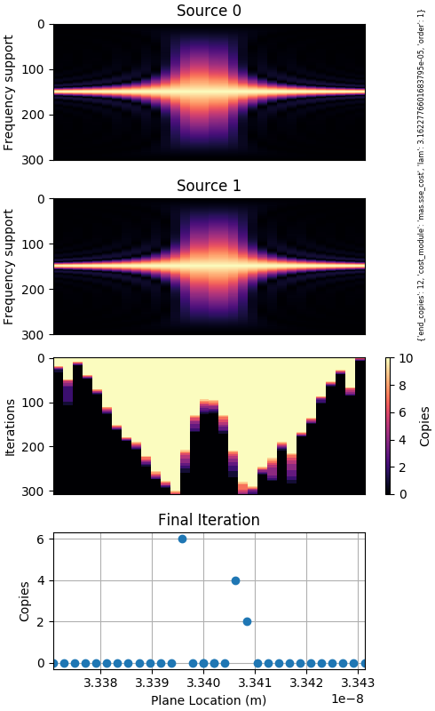

This week I dove into [this paper](https://journals.sagepub.com/doi/full/10.1177/0954410017691315) on attitude estimation by fusing sensor data from the imaging instrument, star tracker and gyro.  It uses the Lukas-Kanade method for registering images, summarized below, then fuses the three motion estimates in an extended Kalman filter.

I also briefly revisited CSBS and engineered a scenario where CSBS finds a measurement configuration that outperforms the naive focus selection method.

# Lukas-Kanade Optical Flow

Optical flow is a registration method geared motion estimation in video where one might have multiple objects moving in a scene.  However, it can still be applied to rigid or affine registration of a whole scene.

The fundamental assumption of this method is that a stationary point in the scene will have constant intensity.  i.e.

$$
\frac{di}{dt}(\bm{x}) + \frac{di}{dx}(\bm{x}) u + \frac{di}{dy}(\bm{x}) v = 0
$$

where $u$, $v$ are the motion vectors.

An implicit assumption here is that $i(x, y, t)$ is a continuous function spatially and temporally, which will be addressed later.

However, the above system is underdetermined because there are two unknowns and only 1 equation.  If we expand the constant intensity assumption to a cluster of points with the same motion vector, the system can be solved.

$$
\underbrace{
\begin{bmatrix}
\frac{di}{dx}(\bm{x}_1) & \frac{di}{dy}(\bm{x}_1) \\
\frac{di}{dx}(\bm{x}_2) & \frac{di}{dy}(\bm{x}_2) \\
\vdots & \vdots \\
\end{bmatrix}
}_{A}
\underbrace{
\begin{bmatrix}
u \\ v
\end{bmatrix}
}_{\bm{v}}
=
\underbrace{
\begin{bmatrix}
- \frac{di}{dt}(\bm{x}_1) \\
- \frac{di}{dt}(\bm{x}_2) \\
\vdots
\end{bmatrix}
}_{\bm{b}}
$$

Which is overdetermined and can now be solved with least-squares:

$$
\begin{aligned}
\bm{v} &= (A^TA)^{-1} A \bm{b} \\
&= \begin{bmatrix}\sum_{\bm{x}} \frac{di}{dx}(\bm{x})^2 & \sum_{\bm{x}} \frac{di}{dx}(\bm{x}) \frac{di}{dy}(\bm{x}) \\
\sum_{\bm{x}} \frac{di}{dx}(\bm{x}) \frac{di}{dy}(\bm{x}) & \sum_{\bm{x}} \frac{di}{dx}(\bm{x})^2 \end{bmatrix}^{-1}
\begin{bmatrix}
\sum_{\bm{x}} \frac{di}{dt}(\bm{x}) \frac{di}{dx}(\bm{x}) \\
\sum_{\bm{x}} \frac{di}{dt}(\bm{x}) \frac{di}{dy}(\bm{x})
\end{bmatrix}
\end{aligned}
$$

We can arrive at this derivation another way, which will help with generalization later.

Define $E(u, v) = \sum \left[ i_2(x + u, y + v) - i_1(x, y) \right]^2$ as the squared error between $i_1$ and registered $i_2$.  With a first order Taylor expansion, we can write

$$
\begin{aligned}
E(u, v) &= \sum \left[ i_2(x + u, y + v) - i_1(x, y) \right]^2 \\
&\approx \sum \left[ i_2(x, y) + u i_{1x}(x, y) + v i_{2x}(x, y) - i_2(x, y) \right]^2 \\
&= \sum \left[ u i_{1x}(x, y) + v i_{1y}(x, y) + D(x, y)\right]
\end{aligned}
$$

where $i_{1x}$ and $i_{1y}$ are the discrete derivatives of $i_1$ in the $x$ and $y$ directions and $D$ is the difference between $i_1$ and $i_2$.

Taking the partial derivatives of the squared error in the x and y directions and setting to zero,

$$
\begin{aligned}
\frac{dE}{du} &= \sum \left[ u i_{1x}(x, y) + v i_{1y}(x, y) + D(x, y)\right] i_{1x}(x, y) = 0 \\
\frac{dE}{dv} &= \sum \left[ u i_{1x}(x, y) + v i_{1y}(x, y) + D(x, y)\right] i_{1y}(x, y) = 0
\end{aligned}
$$

which when collected into a matrix gives

$$
\begin{bmatrix}u \\ v\end{bmatrix} = 
\begin{bmatrix}
\sum_{\bm{x}} i_{1x}(\bm{x})^2 & \sum_{\bm{x}} i_{1x}(\bm{x})i_{1y}(\bm{x}) \\
\sum_{\bm{x}} i_{1x}(\bm{x})i_{1y}(\bm{x}) & \sum_{\bm{x}} i_{1x}(\bm{x})^2
\end{bmatrix}
\begin{bmatrix}
\sum_{\bm{x}} D(\bm{x}) i_{1x}(\bm{x}) \\
\sum_{\bm{x}} D(\bm{x}) i_{1y}(\bm{x}) \\
\end{bmatrix}
$$

which is the same solution as previously given but for discrete $i_1$ and $i_2$.

# Revisiting CSBS

In a [previous report](https://uiuc-sine.github.io/reports/csbs_4modes/index.html), I numerically demonstrated that under our typical simulation assumptions of 33.4 and 33.5nm sources, CSBS plane selection will at best yield a reconstruction quality that is equal to naive plane selection (measuring at focal planes only).  However, at the end of the report I hypothesized that there is a scenario where CSBS might outperforms the naive method.  This scenario, which I call 'failure of the separation condition', occurs when spectral lines from two sources are very close and the out of focus contributions from either source are fairly sharp.

I tested out this idea with an extreme scenario with two sources at 33.4 and 33.402nm and only 0.02nm of separation, comparing the Tikhonov reconstruction quality of naive plane selection vs CSBS under 30dB SNR Gaussian noise.

|       | Source 1 SSIM | Source 2 SSIM |
|-------|---------------|---------------|
| Naive |         0.651 |         0.615 |
| CSBS  |         0.937 |         0.937 |

Previously where reconstruction with CSBS did slightly worse than the naive selection case, CSBS now significantly outperform naive plane selection.  0.02nm of separation between sources is unrealistic, but these tests show that there are at least some situations where CSBS does better.

An interesting note is that CSBS tended to choose measurement locations outside the two focal planes, rather than between them as we had predicted for a long time.  Originally I thought that making measurements where PSF pairs capture a lot of energy from both sources would be best because of high measurement SNR.  However, PSF pairs in this region are very coherent and so it becomes harder to separate the sources.  Instead CSBS opted for measurement locations where one source was in focus and the other out of focus.

