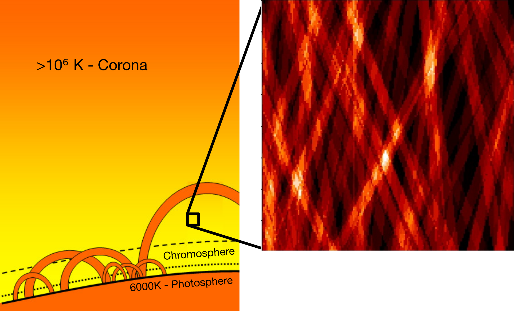
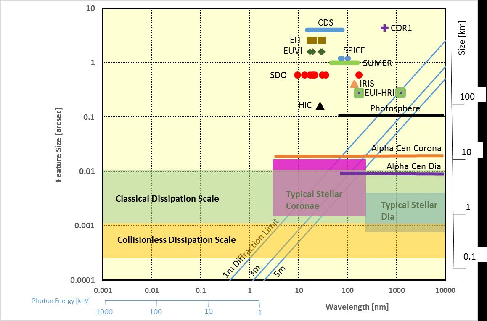
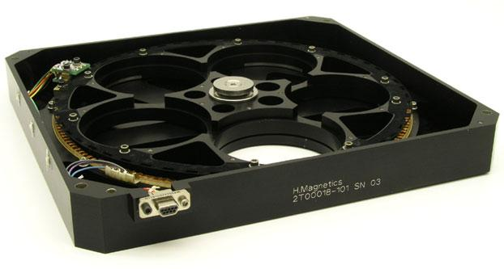
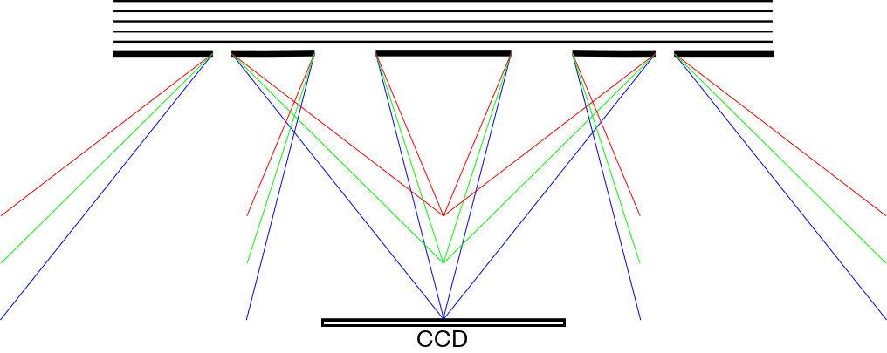
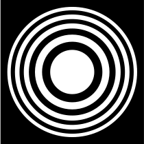
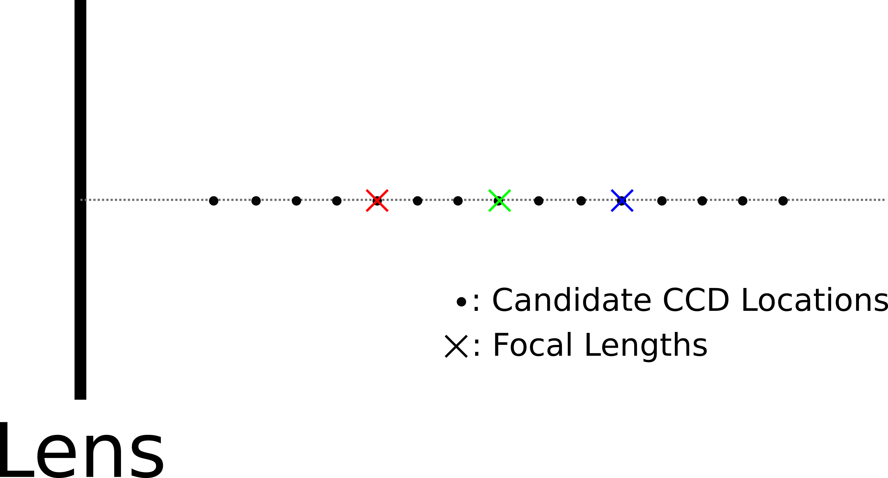

### CSBS Presentation Outline

Ulas and I drafted an outline for what a conference presentation on CSBS might look like.  We want to write a conference paper draft before the Summer is up, but thought it would be easier to get ideas down in presentation form first.

##### Title: A Greedy Algorithm for Measurement Configuration Selection in Spectral Imaging

##### Slide 0 - Coronal Heating Problem

- coronal heating problem has been an open problem in heliophysics for decades:
    - why is the corona 300X hotter than the photosphere?
- perhaps this is due to unobserved 'nanoflares' beyond our current imaging capabilities

##### Slide 1 - Towards the Diffraction Limit

- Conventional telescopes don't have resolution necessary for imaging these small structures
    - Solar Dynamics Observatory (2010, reflective) - 0.6 arcsec resolution
    - Solar and Heliospheric Observatory (1995, reflective) - ??? arcsec resolution
- Very difficult to manufacture reflective optics at the required tolerance - especially at UV wavelengths

*comments about the above diagram*

- secondary vertical axis and information about solar diameters should be removed --> irrelevant to this slide
- what telescope dimension do the 1m/3m/5m diffraction limit lines refer to?
- remove 'classical dissipation scale' and 'collisionless dissipation scale' and rename to simply 'nanoflares' or similar

<!-- ##### Slide 1 - Motivation -->

<!-- - heliophysicists interested in multi wavelength imaging because: -->
<!--     - foo -->
<!--     - bar -->

<!-- - this is called spectral imaging -->

<!-- ##### Slide 2 - Spectral Imaging -->

<!--  -->

<!-- - several types of spectral imaging -->
<!--     - filter wheel -->
<!--     - moving slit -->
<!--     - diffractive element + moving imager -->

##### Slide 2 - Diffractive Optics

-

- diffractive lenses use diffraction to focus light
- they have wavelength dependent focal length

##### Slide 3 - Choice of Measurement Locations

- where should measurements be taken to maximize resolution?
- is it always best to take measurements at the focal planes?

##### Slide 4 - Extremely High Dimensional Search Space

- N candidate measurement locations, K measurements
    - *N^K* measurement combinations to test
    - for our particular problem this is a large number

##### Slide 5 - CSBS: A Greedy Algorithm

- CSBS works by eliminating 1 candidate measurement location at a time
- the measurement location which contributes the least to image quality is selected for elimination
    - multiple cost metrics, e.g. SSE cost

##### Slide 6 - SSE Cost

- not sure whether to include this

##### Slide 7 - Numerical Results
