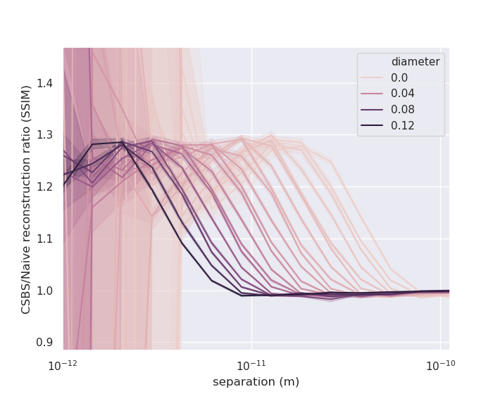
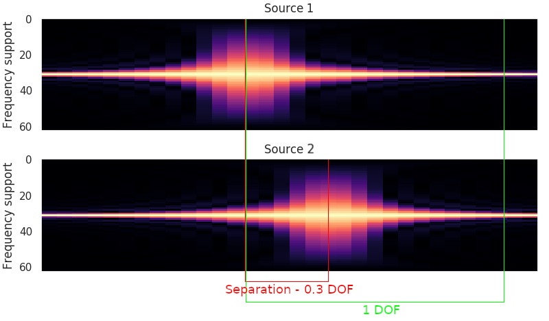
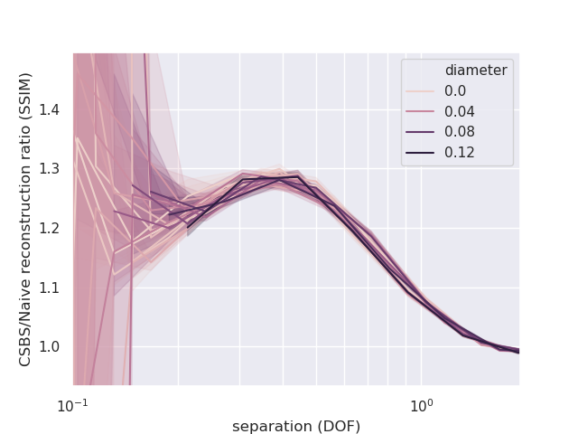

In a previous report, I showed that when two sources are separated by 0.02nm, the reconstructions from measurements selected by CSBS were better than the naive case (measurements taken at focal planes).  While this demonstrated that there are cases where CSBS can outperform the naive case, 0.02nm is an unrealistic number for source separation.  In this report I try to establish some bounds on 2 source reconstruction parameters where CSBS is practicable.

In order to judge how much a reconstruction is improved by the application of CSBS I use the following metric:

$$
\frac{\text{mean}\left[ \text{SSIM}(\text{CSBS source 1 recon.}), \text{SSIM}(\text{CSBS source 2 recon.})\right]}{\text{mean}\left[\text{SSIM}(\text{naive source 1 recon.}), \text{SSIM}(\text{naive source 2 recon.})\right]}
$$

where $\text{SSIM}$ is the *structural similarity index* relative to the original source.  This metric can be considered a measure of reconstruction relative improvement of CSBS over the naive case.

With metric in hand, I tested reconstruction improvement for a variety of values of photon sieve diameter and source separation.  I swept sieve diameter from 1cm to 10cm and source separation from 0.01nm to 1nm, for a total of 400 experiments.

Additionally, I used these fixed parameters:

- 15dB SNR additive gaussian noise
- 7 micron sieve smallest hole diameter
- source 1 wavelength $\lambda_1 = 33.4$nm
- Tikhonov reconstruction $\lambda = 10^{-3}$
- CSBS with SSE cost $\lambda = 10^{-4.5}$

I repeated each experiment for 20 noise realizations and took the SSIM ratio means.

The mean and standard deviation of each experiment is shown in the following line plot.

{: style=max-width:85%}

From this plot, we come to a few conclusions:

1. The ratio converges to 1 with increasing separation, and so the reconstruction improvement from using CSBS is negligible when source separation is large enough.

2. As source separation decreases, improvement in reconstruction hits a peak and then decreases.  I don't have an explanation for why this happens yet.

3. The curves for each diameter have the same shape.  Perhaps there is some underlying parameter which characterizes this curve for all diameters?

I will comment on this third point.  Intuitively, the amount of overlap between PSFs structures will determine how well CSBS outperforms the naive case.  This is the [separation condition](https://uiuc-sine.github.io/reports/csbs_4modes/index.html#failure-of-separation-condition) mentioned in previous reports.  One way to quantify this separation is to divide the difference in source frequencies by the width of these structures.  The width is frequency dependent and can be measured by *depth of focus* (DOF) as illustrated below.

Mathematically, this is equivalent to

$$
\frac{f_1 - f_2}{\text{DOF}_{\lambda_1}} = \frac{Dw (\lambda_2 - \lambda_1)}{\lambda_1 \lambda_2 \text{DOF}_{\lambda_1}} = \frac{D(\lambda_2 - \lambda_1)}{2 w \lambda_1}
$$

where $D$ is the sieve diameter, $w$ is the smallest sieve hole diameter.

{: style=max-width:85%}

In this plot, the curves line up well and it is easy to see that source separation in terms of DOF is the driving factor in reconstruction improvement.  Sources should be separated by less than 1 DOF for CSBS to significantly improve on the naive case (~10% SSIM improvement).  Above 1 DOF, reconstruction quality for CSBS and the naive case are about equal.

Note that this curve applies specifically to 15dB SNR.  It may shift or scale with other noise levels.

### Conclusion

To estimate how much CSBS will improve a reconstruction we can evaluate the above curve at $\frac{D(\lambda_2 - \lambda_1)}{2 w \lambda_1}$.

Plugging in the sieve parameters that we have been using (16cm sieve diam., 33.4/33.5nm sources, 7um sieve smallest hole diam.), I get a separation of about 34 DOF.  This is well above the 1 DOF limit established in the previous section, so the reconstruction improvement from CSBS is negligible for this particular configuration.  This is [corroborated by experimental results from a previous report](https://uiuc-sine.github.io/reports/csbs_4modes/index.html#reconstruction-results).
