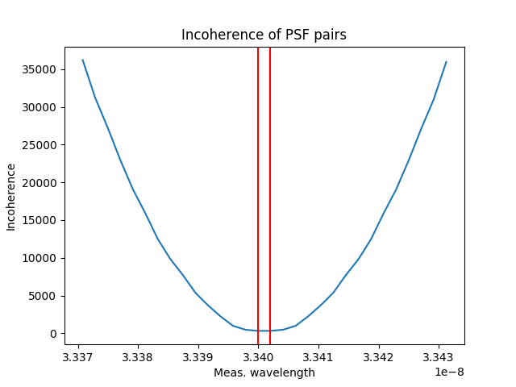

[TOC]

In previous reports ([1](http://uiuc-sine.github.io/reports/2019-07-29/index.html#Revisiting%20CSBS), [2](http://uiuc-sine.github.io/reports/2019-08-19/index.html)), we showed that there are situations in which CSBS outperforms the naive case and demonstrated numerically that for a particular noise setting the performance boost can be predicted from a single problem parameter (source separation in DOF).  In particular, we demonstrated that when two sources are sufficiently close, CSBS tends to choose measurement locations that are outside the two focal planes, rather than between them or at the focal planes themselves.

For a while now, we've said that there seems to be a tradeoff between total energy collected and the ability to distinguish which source a particular feature belongs to.  We predicted that the SSE cost in CSBS was somehow balancing between *energy capture* and some notion of measurement *separability*.

In the next section, I define 4 properties that an ideal separability metric should have and describe some candidates for this metric that were considered, but failed to meet the  4 criterion.  Finally, I look at the SSE cost directly and factor out a term which has all 4 properties.

# Notation

I use the following notation in this document:

$A_{ij}$ are toeplitz matrices containing the PSFs and $A$ is the full measurement matrix containing toeplitz blocks.

$\Lambda_{ij}$ are diagonal matrices whose diagonals contain the PSF DFTs and $\Lambda$ is the full block matrix.

# Measuring separability

We established 4 properties that a separability metric should have.  They are listed below along with a rationale.

1. Matrices with row-rank less than number of sources have separability of 0 (inseparable).
    - Rationale: Sources cannot be distinguished when number of independent rows is less than the number of sources, so these matrices should have separability 0.

2. Invariant to matrix scaling
    - Rationale: A scaling of all elements in $\Lambda$ corresponds to the PSFs capturing more energy.  The energy capture term should take this into account, not separability.

3. Works for non-square $\Lambda$
    - Rationale: For our particular application, $\Lambda$ is usually over-determined, so our separability metric should be able to measure it.

4. Duplicating rows of a separable $\Lambda$ does not cause inseparability.
    - Rationale:  If we start with a measurement configuration which can differentiate between the sources, simply repeating a measurement (i.e. duplicating a row) should not reduce the abiliity to differentiate.

#### Coherence

In a meeting, it was suggested that we try to explain why CSBS behaves this way and I posited that it was due to measurement diversity and that coherence might be a way to measure this.

Mutual incoherence of a matrix $\Lambda$ with columns $a_1, ..., a_m$ is defined as

$$
\text{incoherence}(\Lambda) = \frac{1}{\max_{1 \leq i \neq j \leq m} \left| a_i^Ha_j \right|}
$$

As a curiosity, I plotted coherence for each candidate measurement plane for a system with small source separation in wavelength.

{: style=width:450px}

While this indicates that coherence drops towards the outside of the focal planes (where CSBS is currently choosing measurements), it fails the first two properties.

#### Determinant

Another potential metric we considered early on was $\text{det}(\Lambda)$.

However, it was quickly discarded as it clearly violates condition 3, since determinant is only defined for square matrices.

A well known property of determinants is that scaling a row or column of the matrix also scales the determinant.  Clearly scaling the matrix itself will affect the determinant, so this metric also fails condition 2.

#### Factoring SSE cost

Since the above two metrics failed to have the desired properties, we turned to looking at the SSE cost itself to see if we could split it apart in a meaningful way.

From earlier work, we have the SSE cost for a two-measurement/two-source system in terms of the PSF DFTs.

$$
\text{SSE cost} = \frac{
|\Lambda_{11}|^2 + |\Lambda_{22}|^2 + |\Lambda_{12}|^2 + |\Lambda_{21}|^2
}{
|\Lambda_{11} \Lambda_{22} - \Lambda_{12} \Lambda_{21}|
}
$$

Since separability is something that we want to maximize, we rewrote SSE cost as SSE gain instead.

$$
\text{SSE gain} = \frac{1}{\text{SSE cost}} = \frac{
|\Lambda_{11} \Lambda_{22} - \Lambda_{12} \Lambda_{21}|
}{
|\Lambda_{11}|^2 + |\Lambda_{22}|^2 + |\Lambda_{12}|^2 + |\Lambda_{21}|^2
}
$$

$$
\text{SSE gain} =
\underbrace{
|\Lambda_{11}|^2 + |\Lambda_{22}|^2 + |\Lambda_{12}|^2 + |\Lambda_{21}|^2
}_{\text{collected energy}} \cdot
\underbrace{
\frac{|\Lambda_{11} \Lambda_{22} - \Lambda_{12} \Lambda_{21}|}{|\Lambda_{11}|^2 + |\Lambda_{22}|^2 + |\Lambda_{12}|^2 + |\Lambda_{21}|^2}
}_{\text{separability}}
$$

At first glance, it appears the numerator of the separability term is really $\text{det}(\Lambda)^2$.  However, since we already know that determinant isn't a good separability metric, I hypothesize that the numerator is actually $\text{det}(\Lambda^T \Lambda)$.  This means that the SSE gain should have two terms of the form

$$
\text{SSE gain} = 
\underbrace{
\left( \sum_{i,j} \Lambda_{ij}^2 \right)
}_{\text{collected energy}} \cdot
\underbrace{
\frac{\text{det}(\Lambda^T \Lambda)}{\left( \sum_{i,j} \Lambda_{ij}^2 \right)^2}
}_{\text{separability}}
$$

Further work is needed to show rigorously that this holds for more than two sources.

# Summary

- We hypothesize that SSE cost has a *collected energy* term and a *separability* term which work together to penalize poor measurement configurations.
- I defined 4 properties that I would like such a separability metric to have.
- I show that two previously considered metrics for separability, mutual coherence and determinant, fail these 4 conditions.
- By factoring the *collected energy* term (which is well defined) out of SSE cost, we end up with a new term which we call *separability*.  I show that this metric satisfies the 4 desired properties of a separability metric.

# Appendix: Writing SSE cost in terms of PSF DFTs

This is an old result, but I am including it for completeness.  It describes how to go from the initial formulation of SSE cost in the Sharif paper to a closed form which is in terms of the PSF DFTs for a two-source/two-measurement scenario.

In Sharif's paper, SSE cost is given as $\text{tr} (\Sigma_e) = \text{tr} ((A^TA + \lambda L^T L)^{-1})$

For simplicity, we will assume that there are two sources, two measurement locations, and that $\lambda = 0$.

If we also assume that the measurement process is a circular convolution, we can write

$$
\begin{aligned}
A^TA &= F^{-1} \Lambda^T \Lambda F = 
F^{-1} 
\begin{bmatrix}
  \Lambda_{11} & \Lambda_{21} \\
  \Lambda_{12} & \Lambda_{22}
\end{bmatrix} 
\begin{bmatrix}
  \Lambda_{11} & \Lambda_{12} \\
  \Lambda_{21} & \Lambda_{22}
\end{bmatrix} 
F \\
&= F^{-1} 
\begin{bmatrix}
\Lambda_{11}^2 + \Lambda_{21}^2 & \Lambda_{11} \Lambda_{12} + \Lambda_{21} \Lambda_{22} \\
\Lambda_{11} \Lambda_{12} + \Lambda_{21} \Lambda_{22} & \Lambda_{12}^2 + \Lambda_{22}^2
\end{bmatrix}
F
\end{aligned} \\
$$

where $F$ is a 2D DFT matrix and $\Lambda_{ij}$ are the PSF DFTs.

In order to compute $\text{tr}(\Sigma_e) = \text{tr}((A^TA)^{-1})$, we will use some placeholder variables.
Define \(\Gamma_{11}, \Gamma_{12}, \Gamma_{21}, \Gamma_{22}\) such that

$$
A^TA = F^{-1}
$$

Finally, we end up with the cost

$$
\text{tr}(\Sigma_e) = \frac{\Lambda_{11}^2 + \Lambda_{12}^2 + \Lambda_{21}^2 + \Lambda_{22}^2}{(\Lambda_{11} \Lambda_{22} - \Lambda_{12} \Lambda_{21})}
$$

  <!-- $$ -->
  <!-- A = \begin{bmatrix} -->
  <!-- \Lambda_1 & \Lambda_2 \\ -->
  <!-- c \Lambda_1 & c \Lambda_2 -->
  <!-- \end{bmatrix} \\\, \\ -->
  <!-- B = \begin{bmatrix} -->
  <!-- \Lambda_1 & c \Lambda_1 \\ -->
  <!-- \Lambda_2 & c \Lambda_2 -->
  <!-- \end{bmatrix} -->
  <!-- $$ -->
