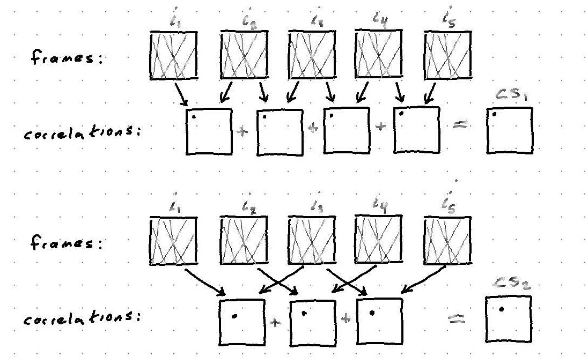
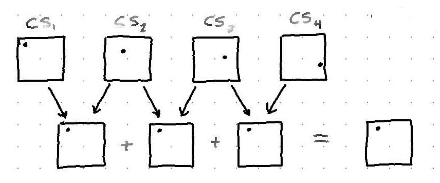
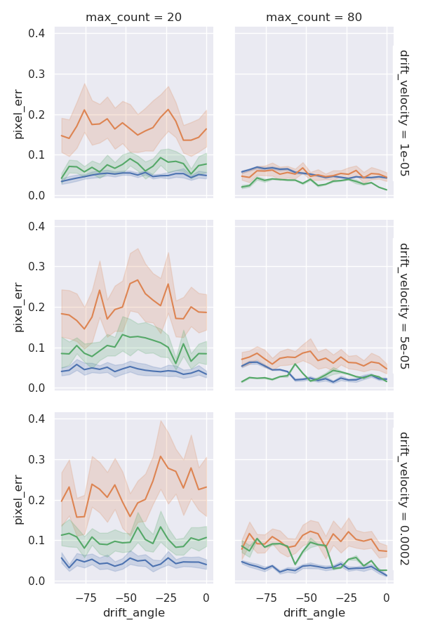

This week I spent time extending the registration method by Guizar-Sicairos, Thurman, Fienup [^1] to a multiframe setting.

In this report, I give a mathematical formulation of this extension, as well as mathematical descriptions of our earlier ad hoc multiframe methods.

Finally, I compare error of the 3 methods at various drift angles, drift velocities and photon arrival counts.

## Adhoc Multiframe #1

Assuming constant linear drift, cross-correlations between adjacent frames should all contain an identical delta at a location corresponding to the drift vector.  These cross correlations can then be summed to help eliminate noise.

Similarly, this process can be repeated for pairs of frames separated by $k=2, 3, 4, ...$ time steps.  This is illustrated below.

We call the images generated by this process *correlation sums*, denoted as $CS_k$

Since $CS_k$ is a sum of cross-correlations of frames separated by $k$ time steps, the location of the delta is scaled by $k$.

Finally, we can obtain an estimate for the drift vector by taking argmax of the correlation sums, scaling by $k$, and taking the mean of the result.

$$
\text{mean} \left[ \frac{\arg \max CS_k}{k} \right]_{k = 1:N-1}
= \text{mean} \left[ \frac{\arg \max \sum_{n=1}^{N-k} \text{CC}(i_n, i_{n + k})}{k} \right]_{k = 1:N-1}
$$

## Adhoc Multiframe #2

This method uses the fact that each correlation sum is close to a shifted copy of the previous correlation sum, where the shift amount is equal to the drift vector.

If we again take cross-correlation of these correlation sums, we should end up with a delta in the same position for each, as shown below.

Finally, we take argmax of the correlation sum to derive a drift vector estimate.  This process is given mathematically below.

$$
\arg \max \sum_{k=1}^{N-2} \text{CC} (CS_k, CS_{k + 1})
= \arg \max \sum_{k=1}^{N-2} \text{CC} \left[ \sum_{n=1}^{N-k} \text{CC}(i_n, i_{n + k}), \sum_{n=1}^{N - k - 1} \text{CC}(i_n, i_{n + k + 1})\right]
$$

From testing, this method gives consistently lower estimation error than the first method.

## Extension of Guizar-Sicairos, Thurman, Fienup registration

#### Original Method

The algorithm presented by Guizar-Sicairos, Thurman, Fienup is a 2-step subpixel registration method which first obtains a coarse, whole-pixel drift vector estimate from standard cross-correlation and then refines it by upsampling the cross-correlation with sinc interpolation.

The major argument of this paper is that the refined estimation step can be greatly accelerated by directly evaluating the DFT in a region around the coarse estimate as opposed to a zero-padded FFT technique.

1. $\text{coarse} = \arg \max \text{CC}(i_1, i_2) = \text{IFFT} \left[ \text{FFT}(i_1) \cdot \overline{\text{FFT}(i_2)} \right]$

2. $\text{fine} = \arg \max \text{UpsampDFT} \left[ \text{FFT}(i_1) \cdot \overline{\text{FFT}(i_2)} \right]$

These coarse and fine estimates are then fused to obtain a complete subpixel registration.

#### Extension

To extend this method to a multiframe setting I first substitute the frequency domain product $\text{FFT}(i_1) \cdot \overline{\text{FFT}(i_2)}$ with a similar sum of products for multiple frames

$$
\text{FFT}(i_1) \cdot \overline{\text{FFT}(i_2)} + \text{FFT}(i_2) \cdot \overline{\text{FFT}(i_3)} + \text{FFT}(i_3) \cdot \overline{\text{FFT}(i_4)} + ...
= \text{IFFT}(CS_1)
$$

The algorithm is carried out identically to obtain a multiframe, subpixel drift vector estimate which I denote $\text{GS}(CS_1)$ (for Guizar-Sicairos).

Similar to Ad Hoc method #1, the results can be fused for all correlation sums

$$\text{mean} \left[ \frac{\arg \max \text{GS}(CS_k)}{k} \right]$$

## Drift Error Results

I tested each of these multiframe registration methods on simulated nanoflare video images under different photon arrival rates, drift velocities, and drift angles.  The Guizar-Sicairos extension usually performs better than the ad hoc methods, especially in the low SNR scenarios.

I repeated each experiment 20 times.  The shaded region around the lines corresponds to +-1 standard deviation.

The error tends to decrease with increasing SNR and decreasing drift velocity, as expected.  One result I found surprising is that the estimation error is fairly independent of drift angle.

{: style="max-width:100%"}

## Summary

- extended subpixel method by Guizar-Sicairos, Thurman, Fienup to multiframe setting
- compared three methods in Monte-Carlo simulation under a variety of scenarios

Next week I plan to finish the Structured Low-Rank Algorithms paper and come to a conclusion about its applicability to our problem.

[^1]: [Guizar-Sicairos, Thurman, Fienup 2008](https://www.osapublishing.org/ol/viewmedia.cfm?uri=ol-33-2-156&seq=0)
