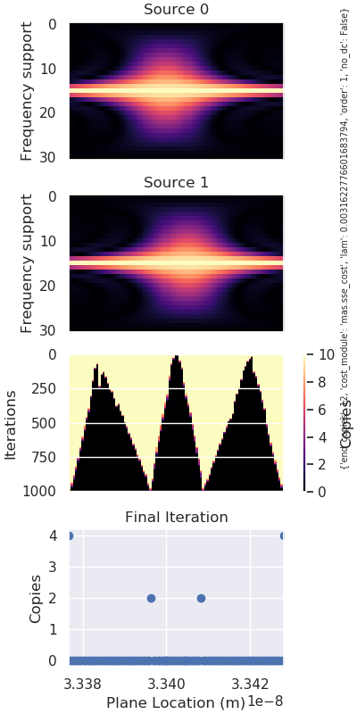
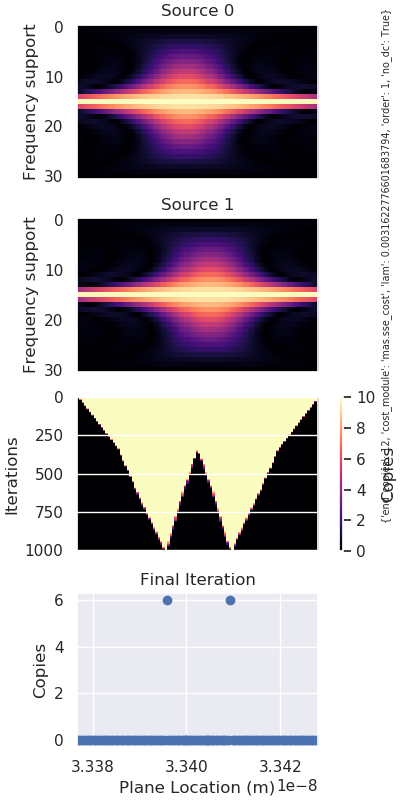
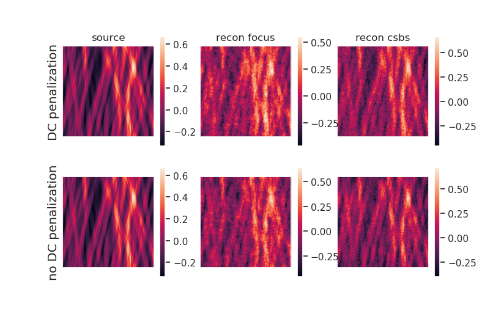
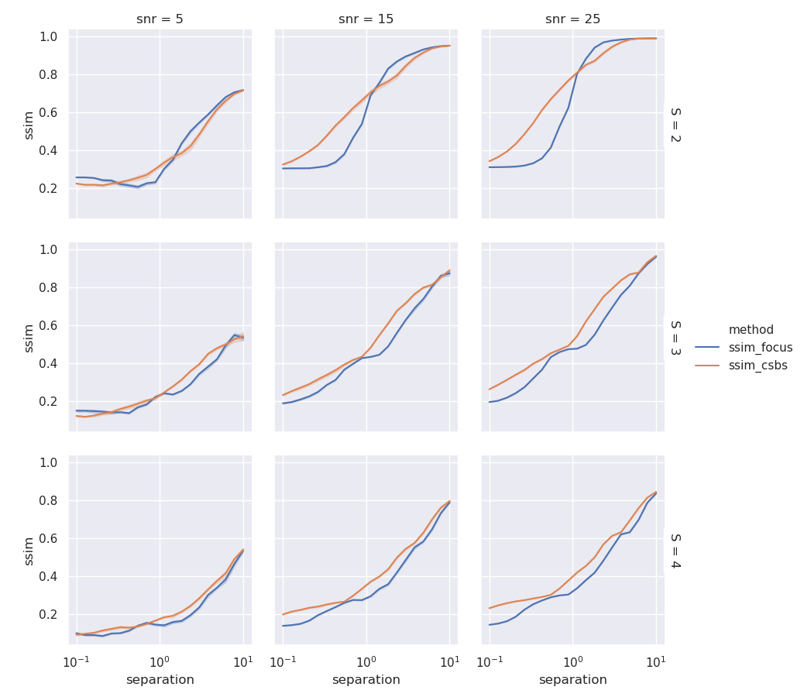

A copy of the outline is [here](https://uiuc-sine.github.io/thesis/outline.html).

Most of my time this week was spent revising the ICASSP paper for submission to ICIP.  The biggest complaint from reviewers was that our experimental results were not extensive enough and should have been tested at different source separations and SNRs.  In an [earlier report](https://uiuc-sine.github.io/reports/2019-08-19/index.html), I had actually run these experiments with different separations for a fixed SNR, but we cut it from the ICASSP draft because of space constraints.

In that report, I plotted the ratio of CSBS reconstruction SSIM to focal reconstruction SSIM as a way of illustrating the relative reconstruction improvement.  However, we decided it would be clearer to plot the SSIMs directly rather than their ratio, shown below:

# DC Penalization

An interesting result from the ICASSP paper is that CSBS often chose measurement locations at the upper and lower limits of the candidate planes.  At these locations, the sensor is only capturing DC from both sources.

In this case, CSBS is using 8 out of our 12 measurements just to capture the DC value of the sources.  If the goal of the project is to detect the presence of nanoflares, we may not care about the overall intensity of the recovered image.  I was interested in seeing what CSBS chose if I ignored DC reconstruction error.

Mathematically, this is equivalent to changing the cost function to

$$\mathbb{E}\left[ \left| \left| \bm{H} \bm{e} \right| \right|_2^2 \right]$$

where $\bm{H}$ is a high pass filter blocking DC.

Now we can see that CSBS has put all measurements at locations where spatial information is actually captured.  If we compare the reconstructions of standard CSBS with no DC penalization CSBS, the nanoflare structures are more apparent in the latter.

Counterintuitively, the SSIM for the bottom right image is lower than the SSIM of the top right image (even after zeroing the means of each reconstruction).  This warrants further investigation.

<!--  -->

# Summary

- plotted CSBS and focal plane reconstruction SSIMs for a variety of scenarios 
    - num_sources={2, 3, 4}
    - SNR={5, 15, 25}
    - source_separation={0.1, ..., 10} DOF
- tested modified SSE cost function where DC reconstruction errors are not penalized
    - reconstructions are visualizer cleaner compared to standard SSE cost, but reconstruction SSIM is lower for an unknown reason
