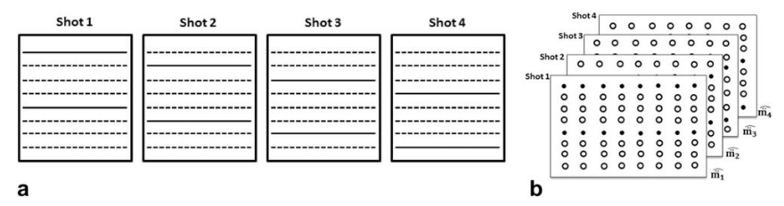

This is an overview of the Structured Low-Rank survey paper by Jacob Mathews.

The main idea of the paper is that a 1D signal exhibiting compactness properties sparsity or smoothness can be "lifted" to a matrix which is low-rank.  If the signal is missing values due to non-uniform sampling, "matrix completion" can be performed on the lifted matrix by exploiting these compactness properties.  Matrix completion is a well studied problem with lots of literature involving performance bounds and efficient algorithms.

The lifted matrix is defined simply as a matrix whose entries "are functions of the signal samples", but from examining the examples, this is almost always the Hankel/Toeplitz matrix of the signal with some window size N.

The impetus for studying this paper is Figure 6a (shown below) which ostensibly shows 3 instances of multiple frames of MRI being registered using structured low-rank matrix completion, so I put effort into understanding what this example was illustrating.

In MRI, samples are acquired in k-space (Fourier domain).  In order to speed up a lengthy acquisition, multiple shots are taken where only a few k-space samples are acquired in each shot (shown below).  

{: style="max-width:800px"}

In a setting with a stationary patient, these incomplete frames could simply be stacked together and an inverse Fourier transform taken to recover the image.  However, stacking like this when there is subject motion or physiological motion (e.g. heartbeat, breathing) between frames result in phase errors that give the ghosting effect mentioned previously [^1].

<!-- {: style="max-width:800px"} -->

This example is not immediately applicable to general purpose registration as the captured shots are not densely sampled.

However, while doing background research and talking to other students, I found 2 papers which use low-rank matrix completion specifically for registration.

[Robust Alignment by Sparse and Low-Rank Decomposition](https://people.eecs.berkeley.edu/~yima/matrix-rank/rasl.html) by Yi Ma

[A Novel Image Registration Method Based on Phase Correlation Using Low-Rank Matrix Factorization With Mixture of Gaussian](https://ieeexplore.ieee.org/document/8048348)

[^1]: [multi-shot sensitivity-encoded difusion data recovery using structured low-rank matrix completion](https://www.ncbi.nlm.nih.gov/pmc/articles/PMC5336529/) - M Mani, M Jacob, D Kelley, V Magnotta
