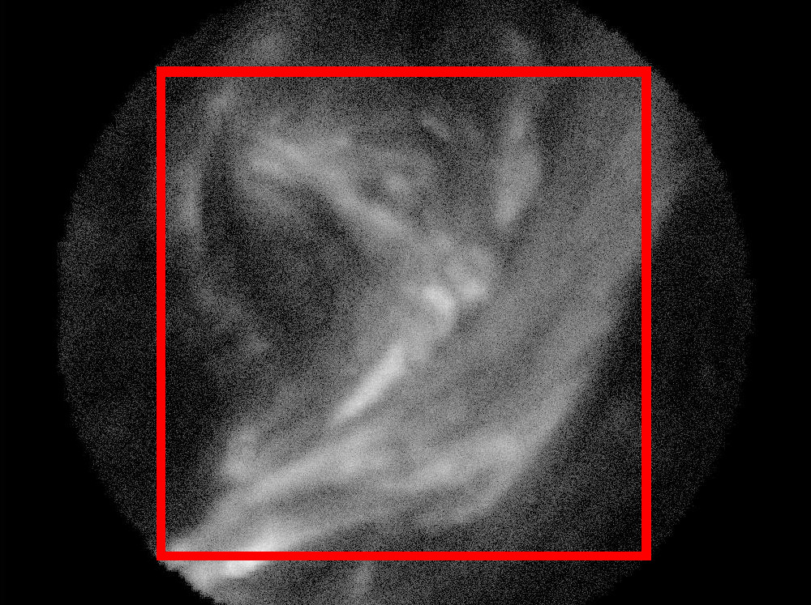

So far we've been testing our pipeline on randomly generated nanoflare images that visually approximate simulation video from Klimchuck.  In this report, I test the same pipeline on upsampled images from AIA, which implicitly assumes there is no additional structure within the images.

In the images generated by Adrian, the sunshade and walls of the tube holding the sieve block light from reaching portions of the detector.  For simplicity, I throw out all pixels outside a square within this visible circle.  Our algorithms could eventually be modified to use all pixels within this circle for an improved registration estimate.

Instead of a $[1000, 762]$ detector, the size is now $[857, 857] / \sqrt{2} = [539, 539]$, where 857 is the diameter of the circle.

The 4096x4096 images from SDO's AIA are taken at 0.6 arcsec resolution.  I crop a small patch from this image which corresponds to VISORS field of view, then upsample the image so it has the correct resolution.  Additionally, I increase the crop field of view by a factor of 2 to allow for simulation of spacecraft drift.  This is what is called the "scene" in our [pipeline documentation](https://uiuc-sine.github.io/reports/pipeline/).

- AIA pixel pitch: 0.6 arcsec
- VISORS pixel pitch (2x2 pixel groups): 0.072 arcsec
- VISORS detector size: [539, 539]

The cropped square of the scene then occupies this size in AIA pixels

$$[539, 539] * 2 * (0.072 / 0.6) = [129, 129]$$

, with black square around VISORS FOV](scene_fov.bmp)

This scene is then upscaled to size

$$[539, 539] * 2 = [1078, 1078]$$

#### Single Frame Simulation

<figure style="text-align: center">
<iframe src="noisy_frame.html" height=550 width=350></iframe>
</figure>

#### Registered + Coadded Reconstruction Simulation

<figure style="text-align: center">
<iframe src="coadded.html" height=550 width=350></iframe>
</figure>
