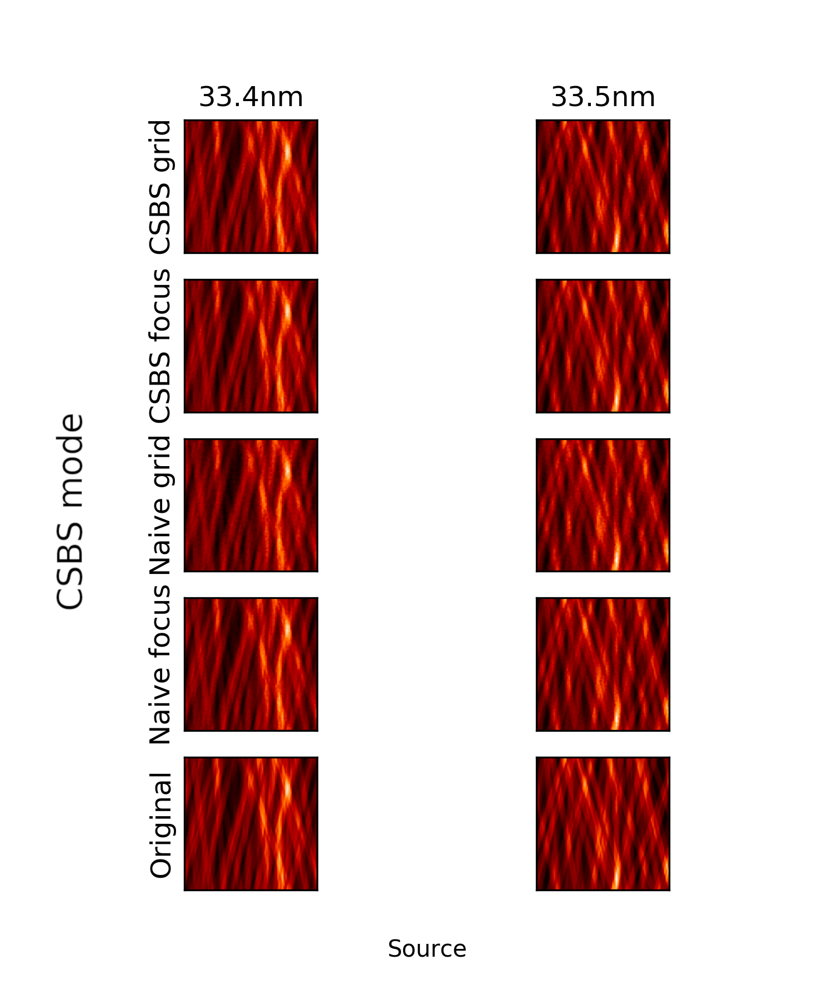
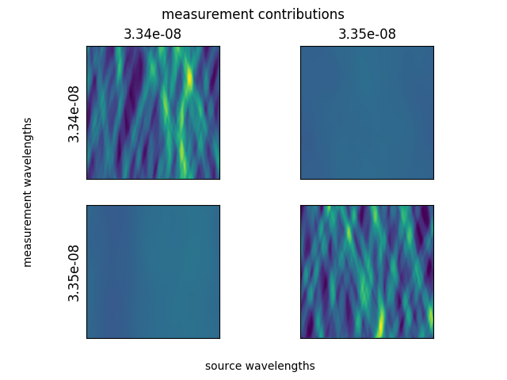

[TOC]

### Overview

In this report, we compare the reconstruction quality of 4 plane selection modes and show that CSBS focus, CSBS grid, and naive focus often yield the same reconstruction quality.  The 4 modes are described below.

* CSBS grid - CSBS with candidate measurement planes spread on a grid from -3 DOF to +3 DOF
* CSBS focus - CSBS with measurement candidate planes initialized at focal planes
* naive grid -  equal number of measurements spread on a grid from -3 DOF to +3 DOF
* naive focus - equal number of measurements at each focal plane

Finally, we propose two situations in which CSBS might improve on the results given by the naive focus mode.

### Reconstruction Results

Below are the reconstruction results for the four plane selection modes with 10 counts of noise and two sources.  The experiment was repeated for 100 noise realizations and the mean reconstruction SSIM for each mode has been plotted.  A 16cm sieve with 7 micron smallest hole diameter was used.

Below the experiment has been repeated for 500 counts of noise.

### Rationale

For a while now, we've hypothesized that CSBS isn't needed for our particular application (i.e. 33.4nm, 33.5nm with 16cm photon sieve) for two reasons:

* 33.4 and 33.5nm have sufficient separation that contributions from one source at the focal plane of the other are effectively DC
* the PSFs of our photon sieves sample all spatial frequencies maximally at the focal plane

If both of these are true then the optimal plane selection strategy is the naive focus mode.

The first condition is supported if we examine a hypothetical scenario in which we are imaging two sources, with one measurement taken at the focal plane of each source.  Since each measurement is a sum of blurred sources, we can split the measurements into the contributions from each source.

To show the second condition, we need to demonstrate that our photon sieve gives PSF DFTs which are maximized everywhere (at all spatial frequencies) at the focal planes.  Below we have plotted horizontal slices from the PSF DFT slices plot.

{: .figure style=max-width:100% }
{: .figure style=max-width:100% }

### Hypothetical scenarios where naive focus is not optimal

#### Failure of separation condition

Below is a plot of PSF DFT slices for a photon sieve where the sources wavelengths are very close together.  The naive focus method would select the focal planes where there is significant off-focus contributions from the other source.

#### Failure of maximization condition

Below is a plot of PSF DFT slices for some hand-crafted PSFs which fail the second condition.  The naive focus method would select the focal planes and could only sample DC for this hypothetical element.  CSBS grid might improve on the result by selecting off focus measurement planes where higher frequency content is available.

### Appendix - Bayesian Optimization

The reconstruction parameters for the above section were all found using bayesian optimization, which is a common tool for searching hyperparameters.  Bayesian optimization is particularly well-suited to optimizing black box functions which are expensive to evaluate.  

In our case, the naive focus and naive grid methods both have a single $\lambda_{tik}$ parameter for Tikhonov regularization, while CSBS grid and CSBS focus have both a Tikhonov $\lambda_{tik}$ and a $\lambda_{csbs}$ used during plane selection.  It's worth noting that for CSBS grid and CSBS focus $\lambda_{tik}$ and $\lambda_{csbs}$ should be the same according to theory, but we found that the reconstruction were much better when these were allowed to be optimized separately.

For posterity, the hyperparameter surfaces for each mode are included below.

### Future work and Ideas

* test CSBS grid on the two hypothetical scenarios
    * for the scenario which fails the separation condition, how does the CSBS grid result change in extreme noise and limited samples?
* can we take advantage of the sinc shape of the DFT slices?  i.e. sample and bandpass filter
