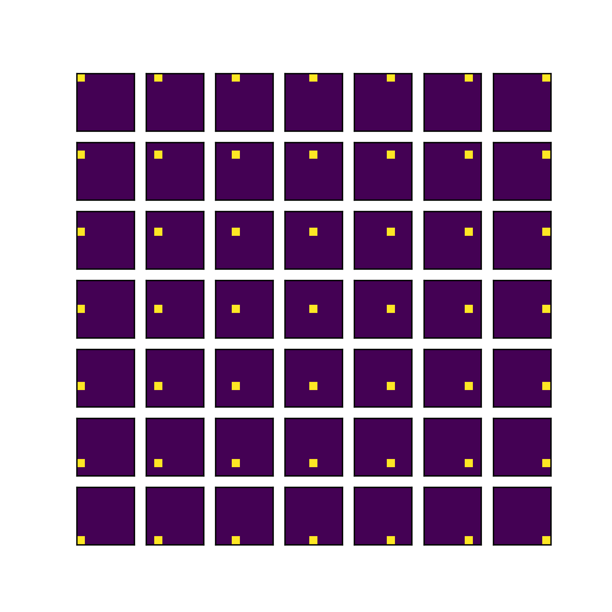
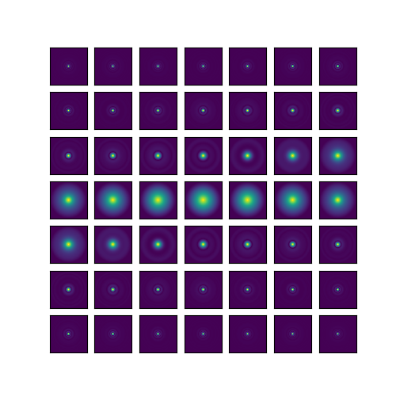
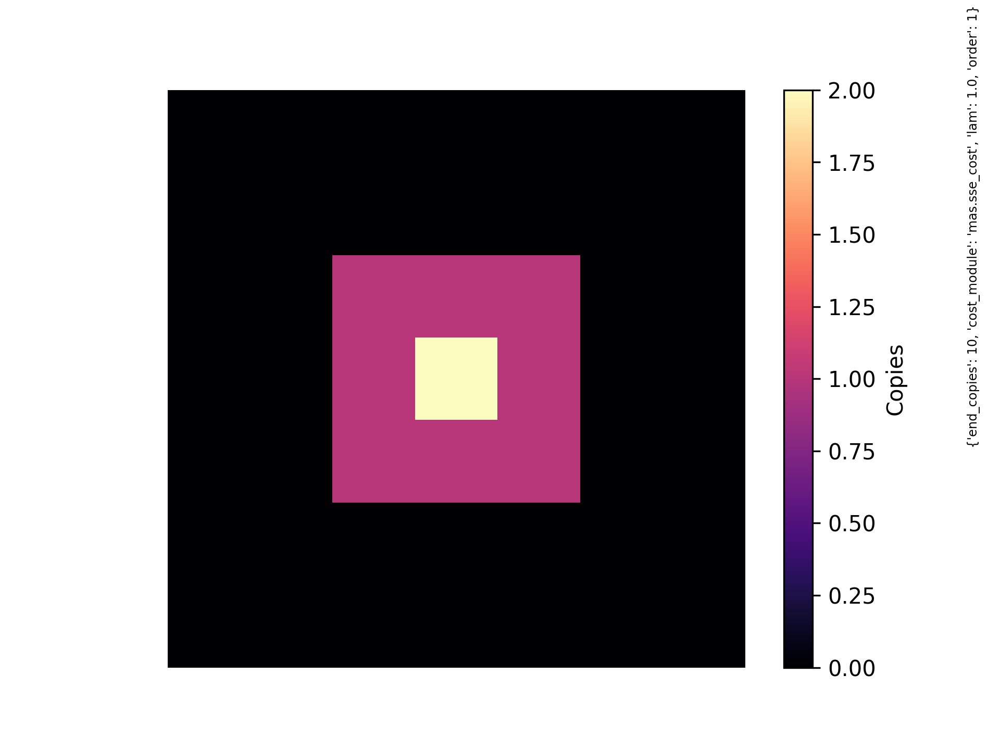
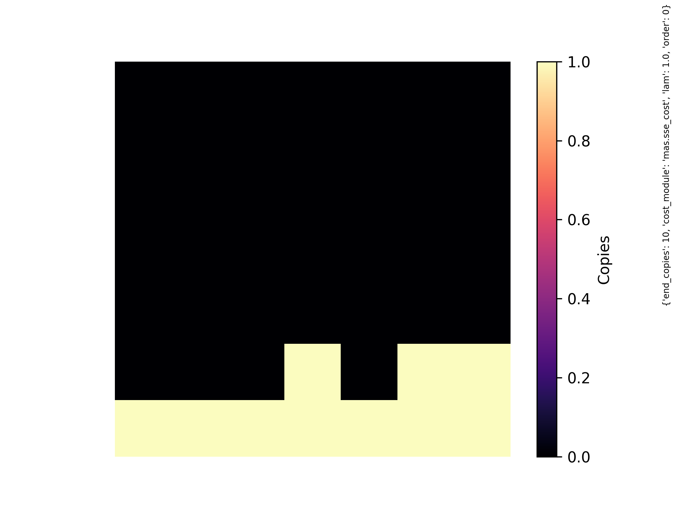

Here I test CSBS with SSE cost on a hypothetical imaging element with hand-crafted PSF DFTs.  Unlike a photon sieve, this element has PSF DFTs which are *not* maximized at the focal length for all frequencies.  The goal of this report is to show that our CSBS implementation chooses a sane measurement configuration when presented with a set of PSFs with very different frequency supports.

# CSBS SSE Cost

$$\text{trace}((A^TA + \lambda^2 L^TL)^{-1})$$

