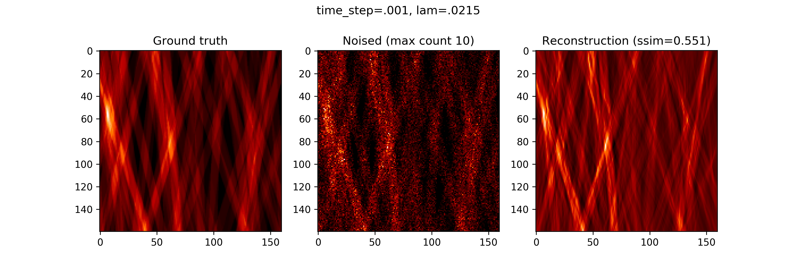
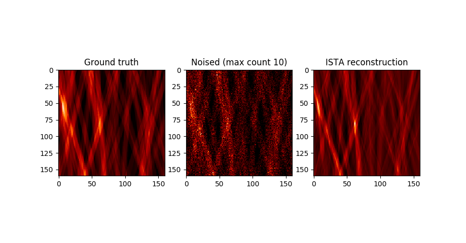
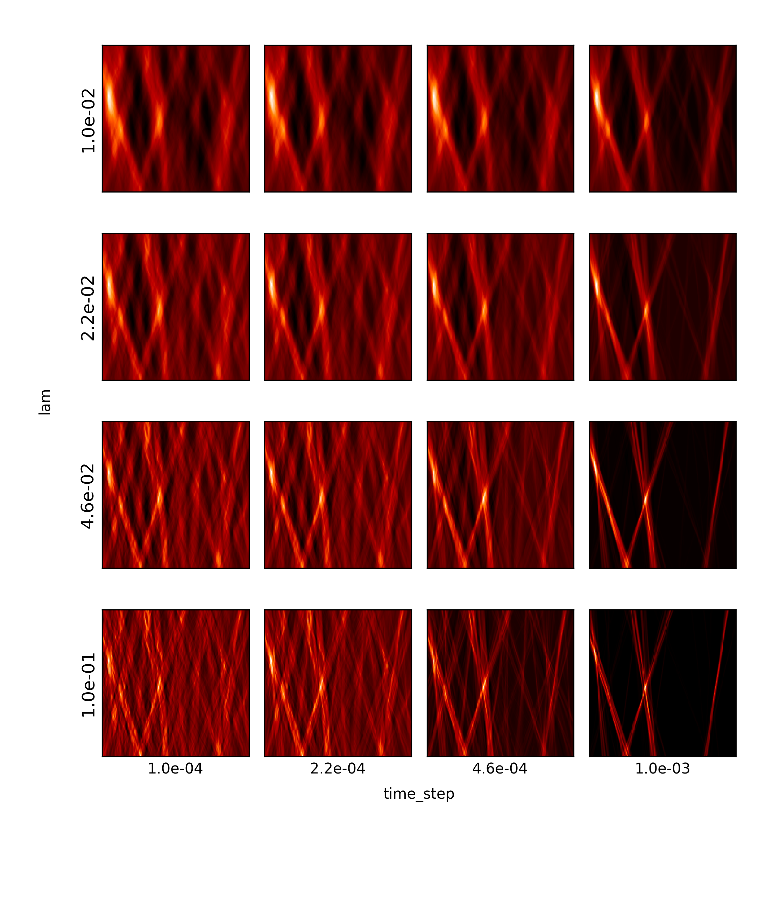

These are ISTA reconstructions of nanoflares images with Poisson noise.  The sparsifying transform used in the algorithm was the Radon transform restricted to \\(\theta = \[-30, 30]\\).

{ style=max-width:100%}

{ style=max-width:100%}

{ style=max-width:100%}
