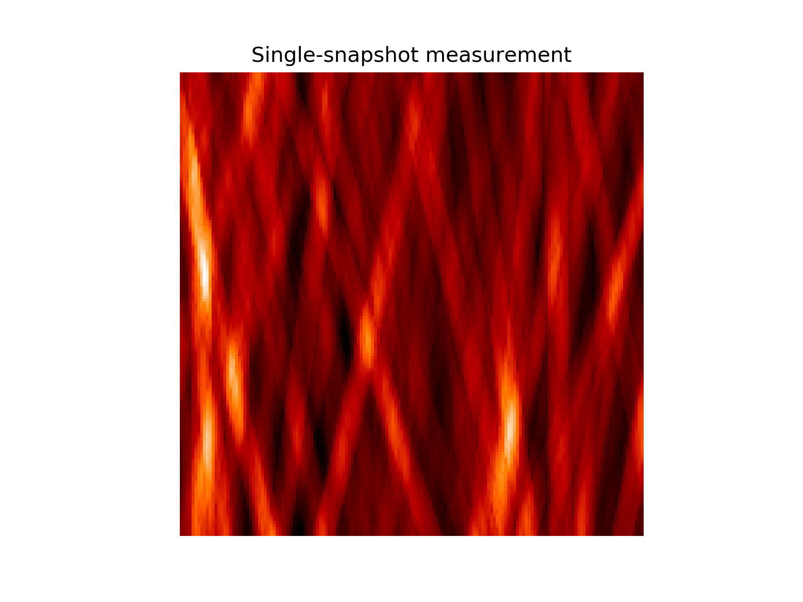
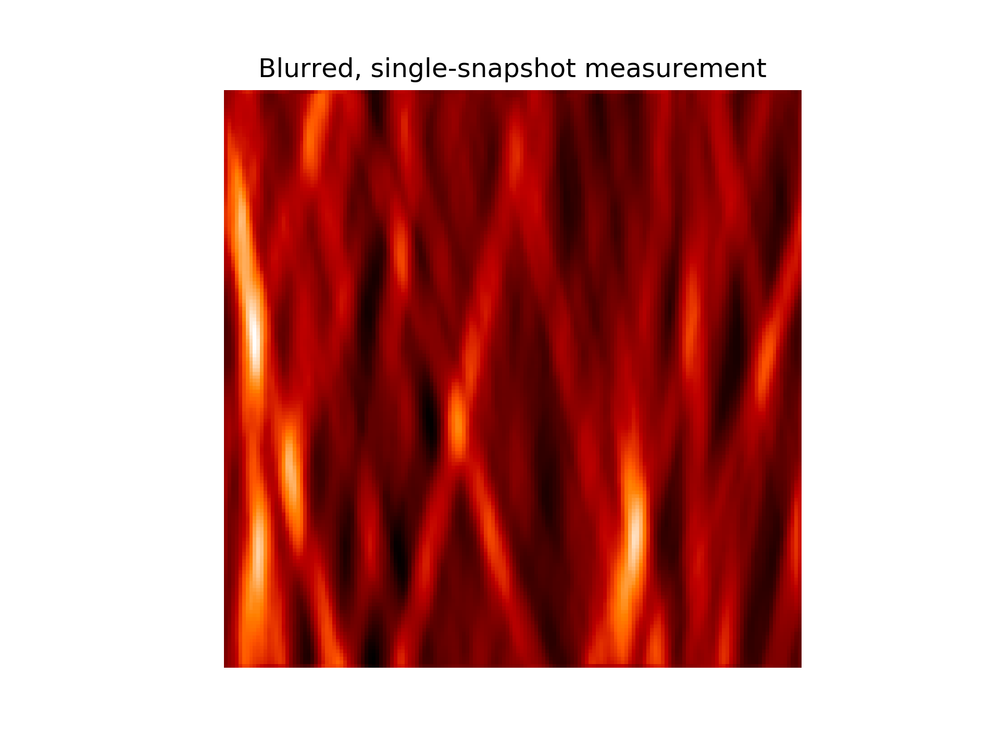
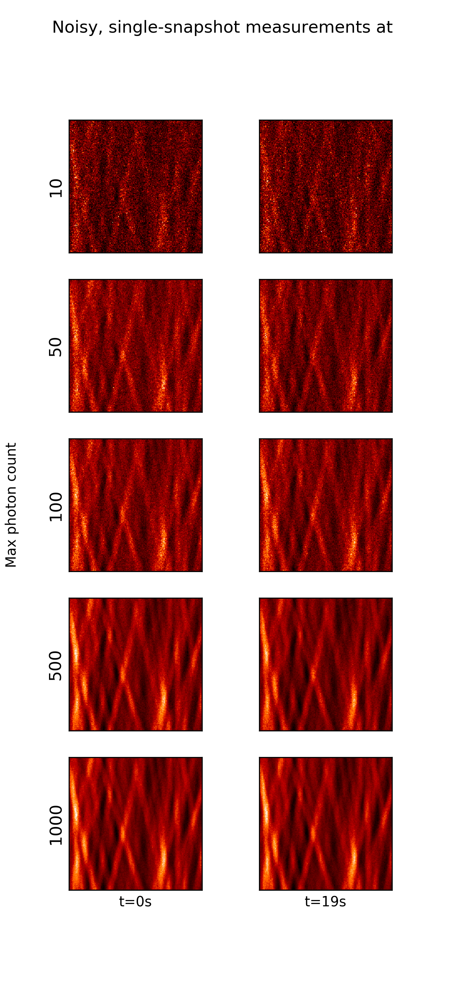

----
title: Noised, blurred nanoflare simulations from Klimchuck simulation
author: Evan Widloski
template: project.j2
date: 2019-04-09
----

# Source

<video width="320" height="240" controls>
  <source src="full.mp4" type="video/mp4">
</video>

* 33.4nm emission wavelength
* 1s integration time
* 50km x 50km on Sun per pixel
* Image 160px x 160px : 8000km x 8000km on Sun total
* Line of sight depth : 40,000km
* Number of strands : 2000 ***

# Measured

* Same nanoflare parameters as above
* Sieve diameter : 10cm
* Sieve sampling interval : 3.5e-6m
* Smallest hole diameter : 7e-6m

# Measured + Noise

Blurry photon sieve measurements at different noise levels.  For each row, the images have been scaled so that the pixel with the largest photon rate is 10, 50, 100, 500 and 1000.  All other parameters are the same as above. Dynamic range has been scaled separately for each image.

