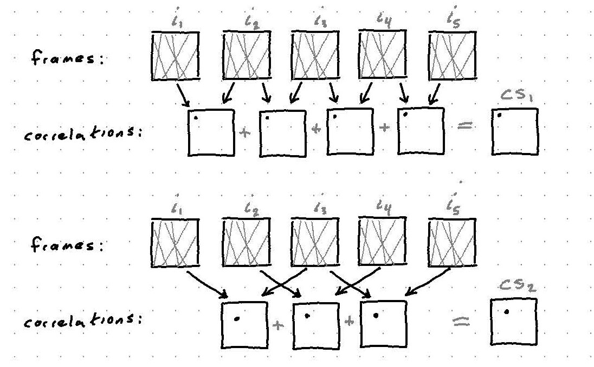

This is a document overviewing the full pipeline of the optics team from generating the nanoflare scene to reconstructing a final image from noisy video frames.

Code used to generate these figures can be found [here](https://github.com/UIUC-SINE/uiuc-sine.github.io/tree/source/content/reports/pipeline).

[TOC]

Pipeline steps in the forward model are used for generating simulated observations, while those under image recovery are used in image recovery.

# Forward Model

## Scene Generation

We begin by generating a static high resolution image which we call the *scene* that has a wide field of view.  This scene is filled with nanoflares of a fixed width but random amplitude and orientation based on Jim Klimchuk's simulations.

{: style=max-width:300px}

This scene is generated at a higher resolution than the detector pitch (and therefore simulated observations) so that we can simulate the effects of motion blur and eventually evaluate effectiveness of super resolution methods.  Additionally, this lets us simulate a spacecraft with non-integer translational velocity.

The diagram below illustrates the relative sizes of the detector pixels and virtual subpixels.

{: style=max-width:500px}

Below is a cropped portion of the scene corresponding to the field of view of the detector at some time instant.  Note that no noise, optical blur or motion effects have been applied yet.

{: style=max-width:300px}

#### Detector and Scene generation parameters

Here are the VISORS detector specs:

- Pixel size: $14 \ \mu m$
- Pixel FOV: $69 \ MAS \ (50 \ km)$
- Detector Size: $750 \times 750$ pixel grid
- Detector FOV: $52$ arcsec $(37500 \ km)$

Let $r_{pix}$ be the ratio of simulated scene pixel size to the detector pixel size, and $r_{FOV}$ be the ratio of simulated scene FOV to the detector FOV, then the simulated image specs become:

- Pixel size: $14/r_{pix} \ \mu m$
- Pixel FOV: $69/r_{pix} \ MAS \ (50/r_{pix} \ km)$
- Scene Size: $750r_{pix}r_{FOV} \times 750r_{pix}r_{FOV}$ pixel grid
- Scene FOV: $52 r_{FOV}$ arcsec $(37500 r_{FOV} \ km)$
- Strand Diameter: $400 \ km$
- Strand Angles: $[-20,20]$ degrees
- Num Strands: $475r_{FOV}$

<!-- 

Detector parameters / Scene generation parameters
 -->
<!-- 
 -->

## Video Frames Generation

Now that we have the high resolution scene, we can generate the lower resolution frames that are captured by the detector.

In this step, we perform the following tasks:

- scaling scene from unitless amplitude to desired counts per second
- blurring from instrument optical path
- blurring from motion of spacecraft during integration

#### Scene Scaling

At this point, the amplitudes of pixels in the high resolution scene are unitless and simply take values between 0 and 1.  We want our image amplitudes to be in terms of photons/s so that noise parameters set in the next step map to physical values.

We do this by scaling the scene so that the maximum pixel takes a particular value (in photons/s).

$$s = \frac{s}{\max{s}} \cdot m$$

where $s$ is the input scene and $m$ is the desired maximum photon count.

#### Optical Blurring

The scene will be blurred slightly as it passes through the instrumentation optics on the two spacecraft.  This step can be represented as a convolution of the scene with the instrument point spread function (PSF).  This PSF can be computed analytically, but we have omitted it here for brevity.

$$
h = \text{PSF}(p_{diam},\, p_{hole},\, \lambda) \\
s = s \ast h
$$

where

- $h$ - photon sieve PSF
- $p_{diam}$ - diameter of photon sieve (m)
- $p_{hole}$ - diameter of smallest hole on photon sieve (m)
- $\lambda$ - wavelength of scene (m)

#### Motion Blurring

As the detector captures an image, the CMOS sensor must collect enough charge, akin to the shutter speed on a conventional camera.  During this period, the spacecraft may drift causing a blurring of the captured image. This effect can be represented as a convolution of the scene incident on the detector with the motion blurring kernel. We generate the motion blurring kernel using an anti-aliased [line generation function](https://github.com/scikit-image/scikit-image/blob/master/skimage/draw/draw.py#L372). 

We take into account the drift and detector parameters to compute the frames. We make two assumptions about the drift of the spacecraft and the scene:

- linear, constant speed drift model without rotation
- imaged structures do not significantly change during acquisition

Given the drift angle, drift velocity, and frame rate, we compute each frame by adding up sub frames along the drift direction. The following diagram demonstrates this operation:

{: style=max-width:500px}

Once the high resolution frames are computed using the coaddition of subframes, they are downscaled to the detector resolution. An example computed frame is given below:
{: style=max-width:300px}

## Noise
Once the clean frames are computed, noise is applied on them according to the detector and scene specs. The parameters that go into the noise model are:

- $x_k$ - (photons/pixel)
- $n_b$ - background noise (photons/s/pixel)
- $n_d$ - dark current (photons/s/pixel)
- $n_r$ - read noise (photons/read/pixel)
- $f$ - frame rate (Hz)

The observation model used for generating each observed noisy frame $y_k$ is

$$y_k = \mathcal{N}\Big( \text{Pois}(x_k + (n_d + n_b) / f),
\, n_r^2\Big)$$

Dark current and read noise are properties of the detector, while background noise is due to off-target sources of light illuminating the sensor.

<figure style="text-align: center">
<iframe src="noisy_frame.html" height=550 width=350></iframe>
</figure>

#### Signal to Noise Ratio
We define the signal to noise ratio in the measured frames as the signal mean divided by the measurement standard deviation. This definition is applied pixel-wise, meaning that each pixel has different SNR. SNR at a pixel $i$ is (assuming noise parameters do not change accross the detector):

$$SNR[i]=\frac{x_k[i]}{\sqrt{x_k[i] + (n_d + n_b) / f + n_r^2}}$$

# Image Recovery

## Drift Estimation

Assuming constant linear drift, cross-correlations between adjacent frames should all contain an identical delta at a location corresponding to the drift vector.  These cross correlations can then be summed to help eliminate noise.  We call the images generated by this process *correlation sums*, denoted as $CS_k$

Similarly, this process can be repeated for pairs of frames separated by $k=2, 3, 4, ...$ time steps.  This is illustrated below.

{: style=max-width:500px}

Since $CS_k$ is a sum of cross-correlations of frames separated by $k$ time steps, the location of the delta is scaled by $k$.

Finally, we can obtain an estimate for the drift vector by taking argmax of the correlation sums, scaling by $k$, and taking the mean of the result.

$$                          
\text{mean} \left[ \frac{\arg \max CS_k}{k} \right]_{k = 1:N-1}
= \text{mean} \left[ \frac{\arg \max \sum_{n=1}^{N-k} \text{CC}(y_n, y_{n + k})}{k} \right]_{k = 1:N-1}
$$

## Video Frames Fusion

Once the drift is estimated, the frames are coadded such that they align with each other, which increases SNR and provides a clean, single frame. Depending on whether we crop the non-overlapping regions of the co-added frames, we have two versions of coaddition: cropped or full, which is demonstrated in the following figure:

{: style=max-width:500px}

<figure style="text-align: center">
<iframe src="coadded.html" height=550 width=350></iframe>
</figure>

## Motion and Optical Blur Removal
The story doesn't end with the coaddition of frames. Although coadding noisy frames helps improve SNR, motion blur is still present in each of these coadded frames.  Depending on the drift velocity and frame rate, this blur degrades our resolution in the direction of drift. 

Other than the motion blur, there is also the optical blur in the frames due to the photon sieve PSF. We would ideally remove this blur as well to get a sharper reconstruction. 
Note that the coadded image is still noisy and this makes the deblurring a hard task.

In order to obtain the overall blurring kernel, we convolve the motion blurring kernel that is generated using the estimated drift with the photon sieve PSF. This is illustrated in the following diagram:

{: style=max-width:500px}

Once the overall blurring kernel is obtained, we perform deconvolution on the coadded image. The deconvolution algorithm iteratively reconstructs the underlying sharp scene. 

## Future Steps

These are other steps in our pipeline which will be documented in the future.

- super resolution
