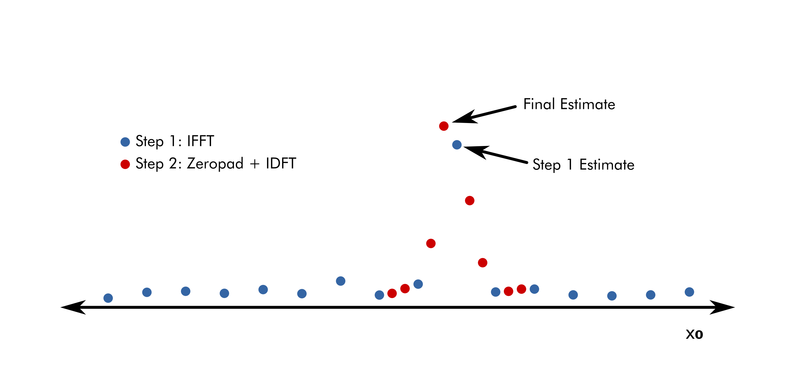
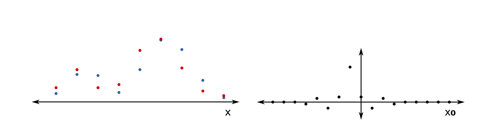
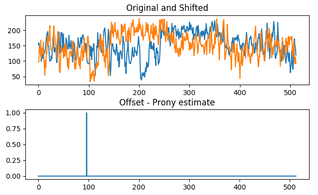
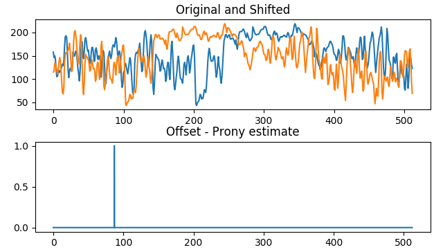

[TOC]

I want to narrow my focus down, so I spent this week investigating a few subpixel registration methods centered around phase-correlation.  Since these phase-correlation methods are all finding a frequency peak in the cross power spectral density (CPSD) of two images, they are technically all spectral estimation methods.

I also introduce Prony's method and my idea for potentially adapting it to finding the peak of the CPSD at non-integer scales.

# Investigated Papers

- [Efficient Subpixel Registration Algorithms](https://www.osapublishing.org/ol/viewmedia.cfm?uri=ol-33-2-156&seq=0) - Guizar-Sicairos, Thurman, Fienup 2008
    - uses standard phase correlation to get whole-pixel estimate, then zero-pad and IDFT to get subpixel estimates
- [Extension of Phase Correlation to Subpixel Registration](https://ieeexplore.ieee.org/document/988953) - Foroosh, Zerubia, Berthod 2002
    - assumes measured images are downsampled version of high-resolution grid
    - observes that non-integer offset results in Dirichlet function around offset freq

# Paper Review - Efficient Subpixel Registration Algorithms

This paper presents 3 subpixel registration methods all based on phase-correlation.  The second of these methods seems to be widely cited because of it's simplicity.

#### Method 1 - Conjugate Descent

The first method presented is a form of conjugate descent on the normalized root mean squared error (NRMSE), which is a translation-invariant measure of error between an image $f$ and a copy $g$ shifted by $(x_0^{\ast}, y_0^*)$.

```math
NMSRE^2 = \min_{x_0, y_0}\frac{\sum_{x,y} |g(x - x_0, y - y_0) - f(x, y)|^2}{\sum_{x,y}|f(x, y)|^2}
```

By minimizing the NMSRE over $(x_0, y_0)$, the true offset of $g$ can be found.  This is not mentioned in the paper, but this error formulation implicitly assumes a circular image shift.

Rewriting the above definition into a maximization problem, we can achieve a more useful formulation

```math
NMSRE^2 = 1 - \frac{\max_{x_0, y_0} |r(x_0, y_0)|^2}{\sum_{x, y}|f(x, y)|^2 \sum_{x, y}|g(x, y)|^2} \\

\begin{aligned}
r(x_0, y_0) &= \sum_{x, y}g(x - x_0, y - y_0)f^*(x, y) \\
&= \sum_{u, v} F(u, v)G^*(u, v) \text{exp}\left[ j 2 \pi \left( u \frac{x_0}{M} + v \frac{y_0}{N} \right) \right]
\end{aligned}
```

where $r$ is cross correlation and $F$ and $G$ are the image DFTs of size $M \times N$.

Since all other terms are constant, we need only minimize $|r(x_0, y_0)|^2$.

```math
\frac{d(r(x_0, y_0))}{dx_0} = 2 \text{Im} \left(r(x_0, y_0) \sum_{u, v} \frac{2 \pi u}{M} F^*(u, v) \times G(u, v) \text{exp} \left[-j 2 \pi \left( u \frac{x_0}{M} + v \frac{y_0}{N} \right) \right] \right)
```

With this partial derivative (and a similar for $y_0$) we can use standard conjugate descent to solve for $(x_0^{\ast}, y_0^*)$.

#### Method 2 - Single Step IDFT

This method is a simple grid-search algorithm which takes advantage of the fact that zero-padding before DFT or IDFT samples the function more finely in the transform domain.

The first step of the algorithm is to obtain a coarse estimate for the shift by applying IFFT to the CPSD and finding the maximum.  Next, $f$ and $g$ are zero-padded by a factor of $\kappa$, CPSD recomputed, and IDFT computed for some select values of $x_0$ around the coarse estimate.  The maximum of these points becomes the final estimate.

The main idea here is that for large values of $\kappa$, computing the IFFT after zero-padding is computationally infeasible and unnecessary.  Computation time is saved by computing several IDFTs instead at select candidate locations around the coarse estimate.




#### Method 3 - Multi Step IDFT

This method is same as above, but multiple stages of zero-padding and IDFT are used to obtain even finer estimates.


#### Conclusion

This paper seems to be popular because of the simplicity of methods 2 and 3.  However, selection of algorithm parameters $\kappa$, number of IDFT stages, and number of IDFT points are not theoretically justified and seem to be chosen by trial and error by the authors.

# Paper Review - Extension of Phase Correlation to Subpixel Registration

This is another popular subpixel registration method based on phase correlation.  I like this paper a bit more than the last in that there are no algorithm hyperparameters to choose.  The authors also give special statistical treatment to the error introduced when the circular-shift assumption is dropped (i.e. images are not repeated on a grid).

#### Main Idea

The fundamental assumption of this paper is that a subpixel shift of an image is actually an integer shift of a higher resolution image that has been subsequently downsampled.

The paper then goes on to show that while phase-correlating the high resolution images results in a dirac delta corresponding to the image offset (a well known result), phase-correlation of the downsampled images yields a sinc function centered at the image offset.

i.e.

```math
\text{PC}_{HR}(x) = \text{IDFT}(\text{CPSD}_{HR}) = \delta(x - x_0) \\
\text{PC}_{LR}(x) = \text{IDFT}(\text{CPSD}_{LR}) = \frac{\sin(\pi(Mx + x_0))}{\pi(Mx + x_0)}
```

where $PC_{HR}$ and $PC_{LR}$ are the high-resolution and downsampled phase-correlation results, respectively.  This is illustrated below.




#### Solving for the subpixel offset

We can analytically solve for the subpixel offset by choosing two points $c_0$ and $c_1$ from the phase-correlation result and applying the $PC_{LR}$ equation.

```math
\frac{\sin(\pi x_0)}{\pi x_0} = c_0 \text{ and } \frac{\sin(\pi (M + x_0))}{\pi (M + x_0) = c_1} \Rightarrow \frac{x_0}{M} = \frac{c_1}{c_0 - c_1}
```

A good choice for $c_0$ and $c_1$ are the highest energy points of the phase-correlation result, shown below.


#### Conclusion

This paper presents a computationally simple approach to subpixel registration which I like better than the more ad-hoc solution presented in Guizar-Sicairos, Thurman, Fienup 2008.  Additionally, the paper analyzes the error introduced from edge effects when the circular-shift assumption is dropped, which I have left out of this report.

One potential area for improvement might be to use more points than just $c_0$ and $c_0$.  Solving the over-constrained system by using all points from $PC_{LR}$ should give better noise immunity at the expense of increased computation time.

# Prony's Method Idea

Both of the above methods assume that the shifted image $g$ was shifted by $(x_0^{\ast}, y_0^*)$ on a high-resolution grid and then subsequently downsampled.  They both only estimate the position of the peak of the CPSD up to the resolution of this grid.  However, there are spectral estimation techniques such as MUSIC, ESPRIT and Prony's method which make no such assumption and can potentially recover the peak location to infinite precision (assuming no noise).  I haven't yet seen this approach in any papers, although Liao, Fannjiang 2014 has a similar idea for another domain (direction of arrival estimation).

There are a number of variations of Prony's method, but I chose the one presented in ECE551.  i.e. find an annihilating filter and compute its roots.

#### Overview


Prony's method is capable of recovering a signal of the form

```math
x(t) = \sum_{k=0}^{K-1} e^{j 2 \pi \omega_k t}
```

exactly given a finite number of samples.

By solving the following system for the FIR filter $h$

```math
\begin{bmatrix}
x[0] & \dots & x[K] \\ & \vdots & \\ x[N - K - 1] & \dots & x[N - 1]
\end{bmatrix}
\begin{bmatrix}h[K] \\ \vdots \\ h[0] \end{bmatrix} =
\begin{bmatrix} 0 \\ \vdots \\ 0 \end{bmatrix}
```

then solving for the roots of the polynomial formed by $h$, we can find the exact $\omega_k$s that form $x$.

#### Preliminary Tests

Below are some simple tests of using Prony's method to recover offset of two 1D signals from phase-correlation.  The conclusion is that Prony's method fails to recovery the offset in the presence of large noise or when the circular-shift assumption is dropped.  I hope to address these issues this week.





# Other Papers
- [Fundamental Performance Limits in Image Registration](https://ieeexplore.ieee.org/document/1323100) - 2004
    - Establishes some theoretical bounds on image-registration accuracy.  No specific treatment of super resolution
- [A Prony Method for Noisy Data](https://ieeexplore.ieee.org/stamp/stamp.jsp?tp=&arnumber=1457117) - Kumaresan, Tufts, Scharf 1983
    - Potential improvement of results in preliminary tests
- [MUSIC for Single-Snapshot Spectral Estimation: Stability and Super-resolution](https://arxiv.org/pdf/1404.1484) - Liao, Fannjiang 2014
    - This is paper is similar to my Prony's method idea in that they apply sparse spectral estimation techniques to phase-correlation.  However, they use MUSIC instead of Prony's method and their problem is related to direction estimation rather than image registration.

# Plans
- implement Kumaresan, Tufts, Scharf 1983 paper
- investigate effects of dropping circular-shift assumption on the CPSD (see section in Foroosh paper)
- review Liao, Fannjiang 2014 paper
