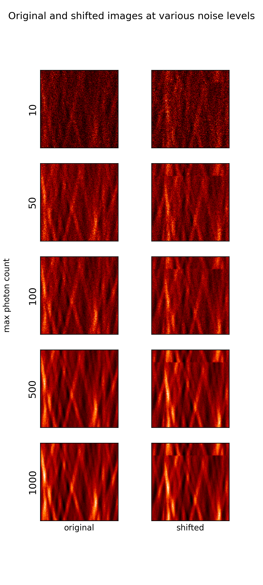
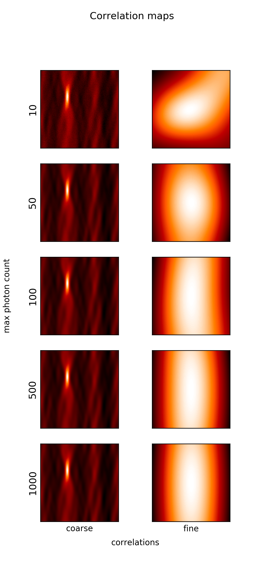

----
author: Evan Widloski
template: project.j2
date: 2019-04-18
title: Single-step DFT subpixel registration under Poisson noise
----

Suppose $y$ is a copy of some image $x$ circularly-shifted by vector $\tau$.  By the Fourier shift property we have

$$Y(\omega) = X(\omega) e^{-j \omega \tau}$$

Phase-correlation techniques take advantage of this property by observing that the cross-spectral density, $R_{XY}$, has the property

$$R_{XY}(\omega) = \frac{X(\omega)\overline{Y(\omega)}}{|X(\omega)\overline{Y(\omega)}|} = \frac{X(\omega) \overline{X e^{-j \tau \omega}}}{|X(\omega) X(\omega) e^{j \tau \omega}|} = e^{j \omega \tau}$$

Where $\tau$ can be extracted by simple IFFT and argmax.

The naive method of extending phase-correlation for subpixel registration is to zeropad $R_{XY}$ by a factor $\kappa$ times the original image size before computing the IFFT to obtain a finer sampling grid.  However, when we desire finer subpixel estimates (like $\kappa=100$), it becomes intractible to compute and store such a large IFFT.

This is a test of the subpixel phase-correlation image registration method proposed by [Guizar-Sicairos, Thurman, Fienup](https://www.osapublishing.org/ol/abstract.cfm?uri=ol-33-2-156).  The paper proposes that if we can roughly estimate the image offset, we need only compute a small region of the inverse fourier transform using IDFT instead of IFFT.

Below is a test of the proposed algorithm on a set of Poisson-noised nanoflare images.  The image offset was first roughly estimated by IFFT of $R_{XY}$.  Subpixel registration was then performed using IDFT with $\kappa=100$.

Note that the test images are circularly shifted.  When registering non-circularly shifted images, it will be necessary to apply a filter to reduce edge effects, such as a Log-Gabor filter proposed by [Sarvaiya, Patnaik, Kothari](http://www.jprr.org/index.php/jprr/article/viewFile/355/148).

# Computed Errors

Offset error statistics for 10 noise realizations at each noise level are below.

Error is measured linearly in pixels.

   Max photon count | offset error mean (px)| offset error std. (px)
--------------------|-----------------------|---------------------------
    10              |          0.544        | 1.8e-3
    50              |          0.271        | 9.6e-4
   100              |          0.196        | 6.8e-4
   500              |          0.092        | 2.9e-4
  1000              |          0.068        | 9.4e-5
