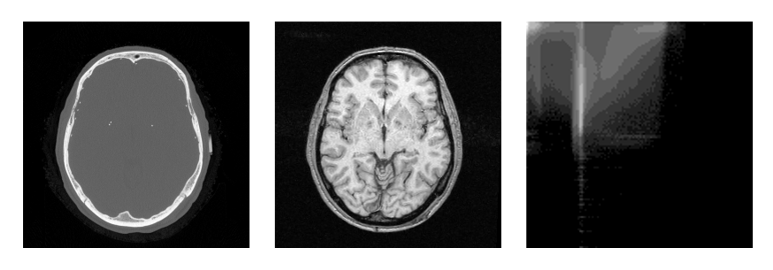

[TOC]

# Introduction

Image registration is the process of overlaying two images of the same scene taken at different times, different viewpoints, or with different imaging equipment.  Registration is an important step in countless fields in remote sensing.  Geographic information systems (GIS), medical computer tomography (CT), cartography and computer vision all make extensive use of image registration for the purposes of image fusion and denoising, change detection or super-resolution.

Let $i_1$ and $i_2$ be two images captured of a scene.  These are often called the *reference* and *template* images.  In image registration, we want to find a mapping from regions in the template image to regions in the reference image.  More formally, we want to find $f$ such that

$$
i_2(\bm{x}) = g(i_1(f(\bm{x}))) \,\, \forall \bm{x} \in X
$$

where $\bm{x}$ is a 2D coordinate in the image overlap region $X$, $f$ is some unknown coordinate transform, and $g$ is an unknown intensity mapping function.  In the simple case, $g$ is often assumed to be unitary, but can be a very complicated function in multimodal applications like medical imaging where $i_1$ and $i_2$ are captured from different instruments.

*Zitova, Flusser 2003* generalizes all image registration algorithms into 4 steps.  Note that certain algorithms omit some of these steps.

1. **Feature detection** - Distinct features (points, edges, closed regions, intersections, corners, etc.) are detected in both images.  These features may be represented by coordinates (intersections, corners, etc.), coordinate pairs (edges) or a more complex parameterization.  This step is omitted in area based registration methods.
2. **Feature Matching** - Correspondence is established between features detected in the images.  Feature similarity measures or feature positions within the images may be used to do this.  This step is omitted in area based registration methods.
3. **Transform model estimation** - The parameters of the coordinate mapping function $f$ are computed using the previously matched features.
4. **Image transformation** - The sensed image is transformed using the estimated parameters and optionally fused with the template image.  Interpolation may be necessary if the mapping function contains non-integer coordinates.

In the next section, I highlight some classical and/or popular contemporary image registration methods and the domains in which they are applied.

### A Comment on Notation

This document contains many types of variables which can represent transform parameters, placeholder variables inside optimizations, 1D vectors of parameters and 2D images.   I try to follow these guidelines for easier reading:

* bold for variables which represent 1D vectors.  e.g. $\bm{x}$ is a coordinate vector representing position within an image
* subscript 0 for all parameters of $f$.  e.g. $s_0$ and $\theta_0$ are parameters controlling scaling and rotation
* $\hat{}$ mark for placeholder variables in maximization or minimization problems. e.g. $\hat{\theta}$ may represent the current value under test in an iterative algorithm searching for $\theta_0$
* superscript $*$ for final parameter estimates obtained by registration methods. e.g. $\theta^*$ is a best estimate for the true $\theta_0$

# Area based Registration

There are two overarching categories of image registration algorithms, area based and feature based.  Area based methods perform no feature detection or feature mapping and instead use all available pixels in the feature matching step <!-- not necessarily true --> to register the images.  Most classical registration methods fall into this category and they are relatively simpler than feature based methods as a result.

This simplicity can sometimes come at a performance cost in certain situations, however.  If a target scene has smooth regions with few salient features to register on, an area based method may perform more poorly than a feature based method which can ignore the smooth parts of the scene that contain little alignment information.

### Correlation-like Methods

##### Cross Correlation
The most straightforward of all methods, direct correlation only works when $f$ is a simple linear translation, $f(x) = x - c$.

$$
f^* = \arg \max_{\hat{f} \in F} \frac{\sum_{x \in X} i_1(x)i_2(\hat{f}(x))}{\sqrt{\sum_{x \in X} i_1(x)^2}}
$$

where $F$ is the set of all linear translations.

Stated more simply

$$
c^* = \arg \max_{\hat{c}} \frac{\sum_{x \in X} i_1(x)i_2(x - \hat{c})}{\sqrt{\sum_{x \in X} i_1(x)^2}}
$$

Note that the normalization here is crucial so that the intensities of $i_1$ and $i_2$ do not influence the maximum.  We call this measure normalized cross correlation (NCC).

<!-- $$ f^* = \arg \max_{\hat{f}} \sum_x i_1(x)i_2(\hat{f}(x)) = \arg \min_{\hat{f}} \sum_x e(x)^2 $$ --> 

In practice, cross correlation is still successful in the presence of slight rotation or scaling.

Related similarity measures which are sometimes used in place of normalized cross correlation are sum of squared error (SSE)

$$
\sum_{x \in X} (i_1(x) - i_2(x - \hat{c}))^2
$$

and correlation coefficient

$$
\frac{\text{cov}(i_1, i_2)}{\sigma_1 \sigma_2} = \frac{\sum_{x \in X} (i_1(x) - \mu_1)(i_2(x - \hat{c}) - \mu_2)}{\sqrt{\sum_{x \in X} (i_1(x) - \mu_1)^2 \sum_{x \in X}(i_2(x - \hat{c}) - \mu_2)^2}}
$$

where $\mu_1$ and $\mu_2$ are the means of $i_1$ and $i_2$ in $X$.

##### Generalized Iterative Cross Correlation

##### Selective Similary Detection Algorithm (SSDA)

In standard correlation methods, the sum over $X$ for each candidate $\hat{f}$ must be computed in full before a maximum is found.  [Barnea, Silverman 1972](https://ieeexplore.ieee.org/stamp/stamp.jsp?tp=&arnumber=5008923) proposes a class alternative schemes which greatly improve computation time in two ways.  The paper calls these algorithms selective similarity detection algorithms (SSDAs), of which one is presented here.

First, the paper uses absolute sum of errors (ASE) as a similarity measure, which requires no costly multiplications unlike NCC or SSE.

$$
\sum_{x \in X} |i_1(x) - i_2(x - \hat{c})|
$$

The second optimization uses early stopping and requires that the above sum over $X$ be implemented sequentially (e.g. as an iterative software loop).  For a particular candidate $\hat{c}$, the current value of the in-progress ASE is compared to a threshold parameter after each iteration.  If the ASE surpasses this threshold, the number of iterations is recorded and the algorithm moves on to the next candidate.  If an candidate computation never exceeds $T$, then the final ASE is recorded instead.

Finally, the candidate with the lowest ASE is selected.  If all candidates surpassed the threshold, then the candidate with the most number of iterations before passing the threshold is selected.

This algorithm offers potentially orders of magnitude speed improvements over direct cross-correlation because of early stopping, but requires selection of parameter $T$.  A choice of $T$ too high limits efficiency gains while a choice of $T$ too low can lead to suboptimal results.

### Frequency Based Methods

If an acceleration over correlation based methods is needed or the images were acquired under frequency dependent noise, Fourier methods are often preferred.  These methods exploit the Fourier representation of methods in the frequency domain and have shown better robustness against non-uniform illumination differences between $i_1$ and $i_2$.

##### Phase Correlation

Phase correlation was originally proposed for registering linearly translated images.  It takes advantage of the Fourier Shift theorem, which states that translating an image and taking its Fourier transform is equivalent to multiplying the Fourier transform of the original untranslated image by a complex exponential.

Computing the cross-power spectral density (CPSD) we can directly obtain this complex exponential.

$$
i_2(\bm{x}) = i_1(\bm{x} - \bm{c})
$$

$$
CPSD(i_1, i_2)(\bm{\omega}) = \frac{I_1(\bm{\omega}) \overline{I_2(\bm{\omega})}}{|I_1(\bm{\omega}) \overline{I_2(\bm{\omega})}|} =
\frac{I_1(\bm{\omega}) \overline{I_1(\bm{\omega}) e^{-j \langle \bm{\omega}, \bm{c} \rangle}}}{|I_1(\bm{\omega}) \overline{I_1(\bm{\omega}) e^{-j \langle \bm{\omega}, \bm{c} \rangle}}|} = e^{j \langle \bm{\omega},  \bm{c} \rangle}
$$

Where $I_1$ and $I_2$ are the Fourier transforms of $i_1$ and $i_2$.  The final estimate for $c$ is obtained by a final inverse Fourier transform of the CPSD, yielding a delta at location $\bm{c}$.

$$
PC(i_1, i_2)(\bm{x}) = \mathcal{F}^{-1}\left[ CPSD(i_1, i_2) \right](\bm{x}) = \delta(\bm{x} - \bm{c})
$$

An important consideration here is that the Fourier Shift theorem only holds exactly when translation is circular.  In practice, the phase correlation method still works if the region of overlap is sufficiently large.  [Foroosh, Zerubia, Berthod 2002](https://ieeexplore.ieee.org/document/988953) propose a prefilter which can be applied to both images before phase correlation to reduce these effects.

##### De Castro, Morandi Method

[De Castro, Morandi 1987](https://ieeexplore.ieee.org/document/4767966) introduced an extension of the phase correlation method which applies to images that are translated and rotated. This method is similar in spirit to the Generalized Iterative Cross Correlation method in that it amounts to repeatedly detransforming $i_2$ with different parameters, testing alignment with $i_1$ using some similarity measure and repeating this process until the correct parameters are found.  Like the standard phase correlation method, this technique claims robustness against frequency dependent noise and non-uniform illumination differences between the images.

Let $i_2$ be a translated and rotated copy of $i_1$.  Then

$$
i_2(\bm{x}) = i_1(R_{\theta} (\bm{x} - \bm{c}))
$$

where 

$$
R_{\theta} = \begin{bmatrix} \cos \theta & - \sin \theta \\ \sin \theta & \cos \theta \end{bmatrix}
$$

is a rotation operator of angle $\theta$.

From the Fourier shift theorem, we know that a shift by $c$ in the spatial domain results in a multiplication by a complex exponential in the frequency domain.  Additionally, the Fourier rotation theorem tells us that a rotation in the spatial domain is a rotation by the same angle in the frequency domain.  Therefore, the relation between $I_1$ and $I_2$ can be written

$$
I_2(\bm{\omega}) = e^{-j \langle \bm{\omega}, \bm{c} \rangle} I_1(R_{\theta} \bm{\omega})
$$

<!-- $$ -->
<!-- CPSD(I_1, \hat{I_2})(\omega) = \frac{I_1(\omega) \overline{I_2(R^{-1}_{\hat{\theta}}\omega)}}{|I_1(\omega) \overline{I_2(R^{-1}_{\hat{\theta}}\omega)}|} = -->
<!-- \frac{I_1(\omega) \overline{I_1(R^{-1}_{\hat{\theta}} R_{\theta} \omega)}}{|I_1(\omega) \overline{I_1(R^{-1}_{\hat{\theta}} R_{\theta} \omega)}|} = -->
<!-- \frac{I_1(\omega) \overline{I_1(R_{\theta - \hat{\theta}} \omega)}}{|I_1(\omega) \overline{I_1(R_{\theta - \hat{\theta}} \omega)}|} = -->
<!-- $$ -->

To find $\theta$, the authors consider the expression

$$
\mathcal{F}^{-1} \left[ \frac{I_2(\bm{\omega})}{I_1(R_{\hat{\theta}} \bm{\omega})} \right]
$$

When $\hat{\theta} = \theta$, we get

$$
\mathcal{F}^{-1} \left[ \frac{I_2(\bm{\omega})}{I_1(R_{\theta} \bm{\omega})} \right] =
\mathcal{F}^{-1} \left[ \frac{e^{-j \langle \bm{\omega}, c \rangle}I_1(R_{\theta}\bm{\omega})}{I_1(R_{\theta} \bm{\omega})} \right]  = \mathcal{F}^{-1} \left[ e^{-j \langle \bm{\omega}, c \rangle} \right] = \delta(x - c)
$$

By testing a range of values for $\hat{\theta}$ for which results in the closest to an impulse in the above expression, an approximate for the true $\theta$ can be found.

Formally, this is the minimization problem

$$
\theta^* = \arg \min_{\hat{\theta}} \left\Vert \mathcal{F}^{-1} \left[ 
\frac{I_2(\bm{\omega})}{I_1(R_{\hat{\theta}}\bm{\omega})}
\right] \right\Vert_N
$$

where $\left\Vert \right\Vert_N$ is a placeholder for a measure which is large for unit impulses.  For example

$$
\left\Vert f \right\Vert_N = \left\Vert f - \delta(x - \arg \max_{\hat{x}} f(\hat{x})) \right\Vert_2
$$

When $\theta^*$ has been found, the offset can be obtained directly from the impulse function

$$
c^* = \arg \max_x \mathcal{F}^{-1} \left[ \frac{I_2(\bm{\omega})}{I_1(R_{\theta^*} \bm{\omega})} \right]
$$

An important note here is that the denominator $I_1(R_{\hat{\theta}} \bm{\omega})$ must be evaluated using interpolation, as $R_{\hat{\theta}} \bm{\omega}$ will not coincide with the sample nodes of $I_1$ in general.

<!-- FIXME author somehow use window to eliminate edge effects? -->

<!-- FIXME need a notational correction here, there are continuous and discrete versions of I in both time and frequency that need to be expressed -->
<!-- \tilde{I}(\omega_x, \omega_y) = \int_X I(x, y) e^{-j(x \omega_x + y \omega_y)} dx\, dy \approx \Delta x \Delta y \tilde{I}(\omega_x, \omega_y) -->

##### Phase Correlation - Rotation/Scale Extension

Phase correlation in its original form is an elegant method of registering translated images.  The method introduced by De Castro and Morandi provides a way to detect and correct for rotation in images before applying phase correlation.  However, another common transformation in imaging systems is scaling, which can occur when the target scene moves closer to the imaging device or if the imager has zoom capabilities.  Like rotation, scaling by a factor $s_0$ can also be written as a matrix operator like so

$$
S_{s_0} = \begin{bmatrix}s_0 & 0 \\ 0 & s_0\end{bmatrix}
$$

[Sarvaiya, Patnaik, Kothari 2012](http://www.jprr.org/index.php/jprr/article/view/355) introduced a new method which is capable of registering images that have been translated, rotated and scaled.  They make use of the Fourier scale, Fourier shift and Fourier rotation properties and also the Log-Polar transform (also known as Fourier-Mellin transform), where rotation and scaling in the original domain manifest as translation in the Log-Polar domain.  Their approach is broken into two applications of the phase correlation method, where the first application is used to recover scale and rotation, and the second, translation.

If $i_2$ is a scaled, rotated and shifted copy of $i_1$,

$$
i_2(\bm{x}) = i_1(R_{\theta_0} S_{s_0} \bm{x} - \bm{c})
$$

$$
\begin{aligned}
&PC \left( \left| \mathcal{LP} \left[ \mathcal{F} \left[ i_1 \right] \right] \right| , \left| \mathcal{LP} \left[ \mathcal{F} \left[ i_2 \right]\right] \right| \right)(x, y) \\
= &PC \left( \left| \mathcal{LP} \left[ \mathcal{F} \left[ i_1 \right] \right] \right| , \left| \mathcal{LP} \left[ \mathcal{F} \left[ i_1(R_{\theta_0} S_{s_0} \bm{x} - \bm{c}) \right] \right] \right| \right)(x, y)  \\
&\text{Apply Fourier shift, scale, rotation properties} \\
= &PC \left( \left| \mathcal{LP} \left[ I_1(\bm{\omega}) \right] \right| , \left| \mathcal{LP} \left[ \frac{1}{s_0^2} e^{-j \langle S_{s_0}^{-1} R_{\theta_0} \bm{\omega}, \bm{c} \rangle} I_1(S_{s_0}^{-1} R_{\theta_0} \bm{\omega}) \right] \right| \right)(x, y) \\
= &PC \left( \left| \mathcal{LP} \left[ I_1(\bm{\omega}) \right] \right| , \left| \mathcal{LP} \left[ \frac{1}{s_0^2} e^{-j \langle S_{s_0}^{-1} R_{\theta_0} \bm{\omega}, \bm{c} \rangle} \right] \mathcal{LP} \left[ I_1(S_{s_0}^{-1} R_{\theta_0} \bm{\omega}) \right] \right| \right)(x, y) \\
&\text{Apply Log-Polar shift property} \\
= &PC \left( \left| \mathcal{LP} \left[ I_1 \right](\rho, \theta) \right| , \left| \mathcal{LP} \left[ \frac{1}{s_0^2} e^{-j \langle S_{s_0}^{-1} R_{\theta_0} \bm{\omega}, \bm{c} \rangle} \right] \mathcal{LP} \left[ I_1 \right](\rho + \ln \frac{1}{s_0}, \theta + \theta_0) \right| \right)(x, y) \\
= &PC \left( \left| \mathcal{LP} \left[ I_1 \right](\rho, \theta) \right| , \left| \mathcal{LP} \left[ I_1 \right](\rho + \ln \frac{1}{s_0}, \theta + \theta_0) \right| \right)(x, y) \\
= &\delta \left(x - \ln \frac{1}{s_0}, y - \theta_0 \right)
\end{aligned}
$$

where $\mathcal{LP}$ is the Log-Polar transform.

##### Phase Correlation - Subpixel Registration Extension

Todo: import from previous report.

### Information Based Methods

Viola and Wells introduced a new class of registration methods in 1994 based on entropy of image pairs.  This class of methods has proven effective in multimodal registration so it has achieved significant popularity in medical imaging.

##### Mutual Information

In the early 20th century, Hartley was looking for a way to measure the transmission of information, particularly in relation to the telegraph as a communications system.  He considered a system in which a finite set of symbols ('dit' or 'dah', telegraph 1's or 0's) are sent sequentially through a channel (telegraph wire).

The number of unique messages that can be encoded given a message length of $n$ and $s$ unique symbols is $s^n$.  However, Hartley wanted a measure that would grow linearly with message length.  A message which is twice as long should contain twice as much information.

He therefore settled on the following measure of information:

$$
H = n \log s = \log s^n
$$

From the first formulation, it is apparent that information grows linearly with $n$.  Another interesting feature of this measure is that if there is only one symbol, we know exactly what the message will be and so it contains no information $(H = n \log 1 = 0)$.  This suggests that entropy can also be viewed as a measure of uncertainty.

A disadvantage of Hartley's entropy measure is that it assumes all symbols are equally likely to occur in a message, which is generally not true.

In 1948, Shannon introduced a new measure of information which takes this fact into account by weighting Hartley's entropy by the probability that symbols occur.  This is now known as Shannon entropy.  For a set of $s$ symbols with probabilities $p_1, ..., p_s$ of occuring, Shannon entropy is given as

$$
H = \sum_k p_k \log \frac{1}{p_k} = - \sum_i p_k \log p_k
$$

Like Hartley's entropy, Shannon entropy can be viewed as a measure of uncertainty.  If a particular symbol has a very high probability of occuring, our uncertainty about the message decreases and hence information decreases.  If all symbols have an equal probability of occuring, entropy is maximized.  Thus Shannon entropy may also be considered as a measure of spread of a probability distribution.  A distribution with most mass concentrated around a few peaks will have low entropy while a more uniform distribution will have higher entropy.

To compute Shannon entropy of an image, all possible intensity values of the pixels can be interpreted as symbols in the message.  For an image with bit depth of 8 bits, one can collect all the intensity values into a histogram in order to compute $p_0, ..., p_{255}$, as shown below.

Now that we can compute entropy for images we must introduce one more concept before registration can occur, joint histograms.  A joint histogram is a 2D function which, for all possible pairs of intensities, describes how many times intensity pairs occur for a pair of registered images.  For example, if a joint histogram has value 17 at coordinate [33, 34], then for this particular registration there are 17 pixels in which the first image has intensity 33 and the second has intensity 44.  In the case of two 8 bit images, the joint histogram is a 256x256 image.  An example joint histogram for two images is shown below.

The joint histogram changes with the alignment of the images.  For a correctly aligned pair of images, structures within the image align and vary with each other, so we expect the intensities to correlate which manifests as clustering in the joint histogram.  As the image pair becomes misaligned, more greyscale combinations are introduced and the joint histogram exhibits more uniformity.  By measuring this uniformity we now have a similarity measure for registration.

Formally, the joint Shannon entropy for a pair of registered images

$$
H(i_1, \hat{i_2}) = -\sum_{m, n} p(m, n) \log p(m, n)
$$

where $p(i, j)$ is the joint histogram of $i_1$ and candidate registered $\hat{i_2}$ in the region of overlap $X$. <!-- FIXME -->

However, a problem that can occur when joint entropy is used directly is that low entropy (high degree of reported alignment) can occur for invalid registrations if the images contain large regions of uniform intensity.  For example, if the images in the figure above are aligned so that only their corners containing background overlap, the joint histogram will have approximately a single peak and the joint entropy will be very low.  To account for this, one can make use of the marginal entropies to penalize alignments where the region $X$ contains little information in the images.  This is known as mutual information.

$$
MI(i_1, \hat{i_2}) = H(i_1) + H(\hat{i_2}) - H(i_1, \hat{i_2})
$$

With this new measure, if the overlap region contains little information, terms $H(i_1)$ and $H(\hat{i_2})$ will be small and counteract joint entropy.  Also note that since mutual information contains $-H(i_1, \hat{i_2})$, minimizing joint entropy is related to maximizing mutual information.

### Optimization Based Methods

Many of the above methods introduce various similarity metrics as measures of alignment between registration candidates.  They mostly rely on an exhaustive search through all potential registration candidates and as such are restricted to situations where the set of all possible $\hat{f}$ candidates are small, usually simple translation.  In situations where the number of parameters controlling $f$ is large, such as elastic transformation, it is appropriate to make use optimization methods that can find minima or maxima in the chosen similarity measure in a feasible amount of time.

##### NMSRE Conjugate Descent

<!-- FIXME assumes linear shift, but this section is about high dimensional f -->

The first method, presented by [Guizar-Sicairos, Thurman, Fienup 2008](https://www.osapublishing.org/ol/viewmedia.cfm?uri=ol-33-2-156&seq=0),  is a form of conjugate descent on the normalized root mean squared error (NRMSE), which is a translation-invariant measure of error between an image $f$ and a copy $g$ shifted by $(x_0^{\ast}, y_0^*)$.

$$
f^*_{NMSRE} = \min_{\hat{f}} \frac{\sum_{x} |i_2(\hat{f}(x)) - i_1(x)|^2}{\sum_{x}|i_1(x)|^2}
$$

By minimizing the NMSRE over $f$, the true parameters of $f$ can be found.

Rewriting the above definition into a maximization problem and assuming $f$ is a linear shift by $[x_0, y_0]$, we can achieve a more useful formulation.

$$
NMSRE^2 = 1 - \frac{\max_{x_0, y_0} |r(x_0, y_0)|^2}{\sum_{x, y}|i_1(x, y)|^2 \sum_{x, y}|i_2(x, y)|^2} \\
$$

$$
\begin{aligned}
r(x_0, y_0) &= \sum_{x, y}I_2(x - x_0, y - y_0)I_1^*(x, y) \\
&= \sum_{u, v} \tilde{I_1}(u, v)\tilde{I_2}^*(u, v) \text{exp}\left[ j 2 \pi \left( u \frac{x_0}{M} + v \frac{y_0}{N} \right) \right]
\end{aligned}
$$

where $r$ is cross correlation and $\tilde{I_1}$ and $\tilde{I_2}$ are the image DFTs of size $M \times N$.

Since all other terms are constant, we need only minimize $|r(x_0, y_0)|^2$.

$$
\frac{d(r(x_0, y_0))}{dx_0} = 2 \text{Im} \left(r(x_0, y_0) \sum_{u, v} \frac{2 \pi u}{M} \tilde{I_1}^*(u, v) \times \tilde{I_2}(u, v) \text{exp} \left[-j 2 \pi \left( u \frac{x_0}{M} + v \frac{y_0}{N} \right) \right] \right) $$

With this partial derivative (and a similar for $y_0$) we can use standard conjugate descent to solve for $(x_0^{\ast}, y_0^*)$.

##### Gauss-Newton Minimization

##### Levenberg-Marquardt

# Feature Based Registration

# Summary

Area based methods are preferred when images have salient details and information is provided by pixel intensities rather than shapes and structures in the imae.  The images' intensities must be similar or at least statistically ..  The set of candidate $f$ that can be searched is generally limited to translation with small amounts of rotation or skew, but there are some extensions to methods that support large rotations or skews so long as the degrees of freedom of $f$ remains small.  Pyramid search techniques and sophisticated optimization strategies are available to more quickly find extrema of the similarity measure.

Feature based methods are generally utilized when shapes in structures in the image pair contain more alignment information than the pixel intensities, such as between a picture of an object and a computer model of an object.  The drawback of these methods is that such features can be hard to detect and match with each other.  It is critical that chosen feature detector be robust against any differences between the images.

# References
- [Image registration methods: a survey](https://www.sciencedirect.com/science/article/pii/S0262885603001379/pdfft?md5=9ac6884a88ac624d4861de8fe7666e27&pid=1-s2.0-S0262885603001379-main.pdf) - Zitova, Flusser 2003
- [A Survey of Mutual Information Based Registration](https://www.google.com/search?q=survey%20of%20mutual%20information%20based%20registration) - Pluim, Maintz, Viergever 2003

